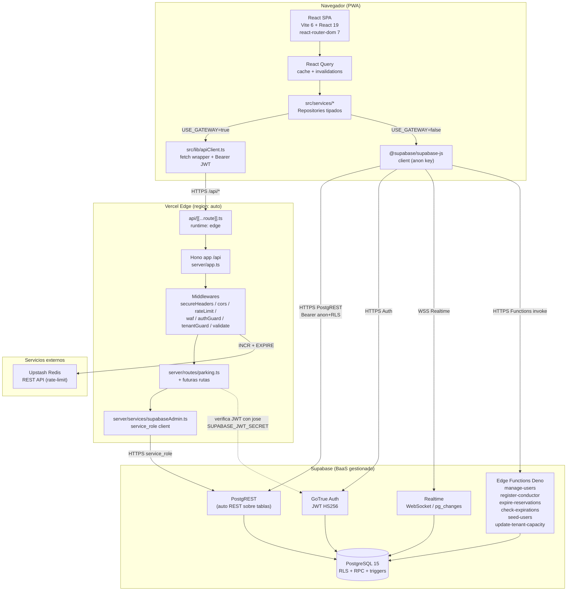
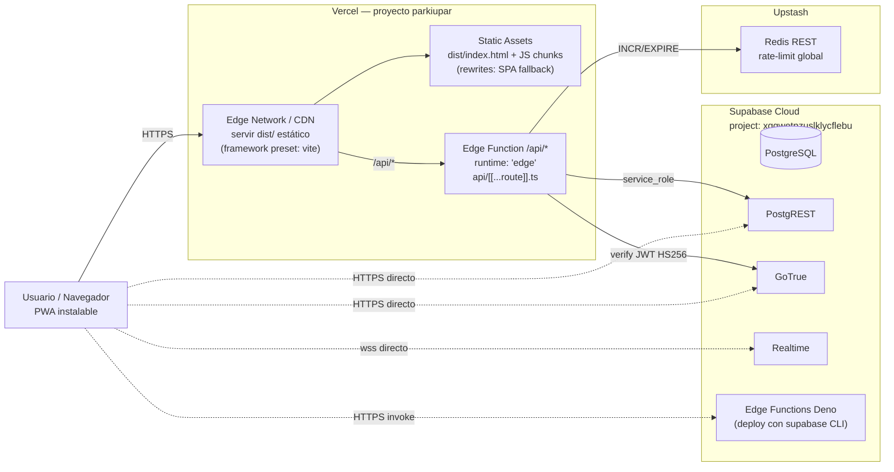
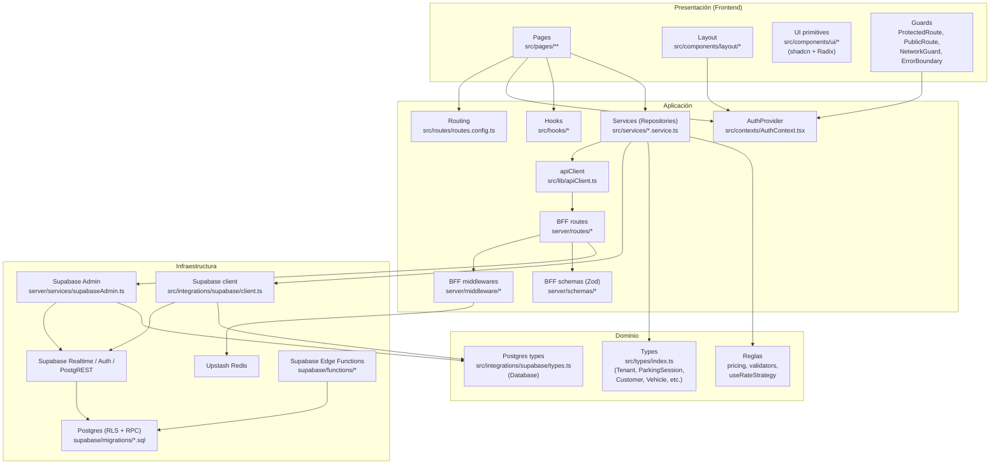

# Parkiupar — Arquitectura y Diseño Técnico

> Documento generado a partir del análisis estático del repositorio en la rama `miguel`. Refleja el estado real del código al 2026-05-14. Cualquier afirmación está respaldada por una ruta y, cuando aplica, una línea concreta.

---

## 1. Notas metodológicas

### Enfoque arquitectónico aplicado

Se combinan dos vistas complementarias del **modelo C4** y del **modelo 4+1 de Kruchten**:

- **Vista lógica / de componentes y conectores (C&C)** — Sección 3. Muestra los componentes en ejecución (SPA, BFF Edge, Supabase, Edge Functions, Redis) y los conectores entre ellos (HTTP/REST, WebSocket Realtime, JWT, Postgres wire). Esta vista es la más informativa porque el sistema tiene varios procesos que cooperan en tiempo de ejecución.
- **Vista de despliegue** — Sección 4. Aterriza los componentes lógicos sobre la plataforma real de Vercel y los servicios gestionados externos (Supabase, Upstash Redis), incluyendo runtime Edge, regiones y variables de entorno.
- **Vista de capas (layered)** — Sección 5. Cruza el código del frontend y del BFF en capas (Presentación → Aplicación → Dominio → Infraestructura) para evaluar el respeto de la regla de dependencia.
- **Vista de descomposición funcional** — Sección 6. Agrupa carpetas por capability/feature (parking, reservas, clientes, billing, etc.) para entender el mapa del producto.

Se eligió esta combinación porque Parkiupar es una **SPA multi-tenant con un BFF (Backend-for-Frontend) ligero en Edge + un backend gestionado (Supabase)**: una sola vista (p. ej. solo capas) ocultaría la naturaleza distribuida; solo una vista de despliegue ocultaría el diseño interno del BFF y de los servicios del frontend.

### Fuentes consultadas (archivos clave)

| Área | Archivos representativos |
|---|---|
| Build / infra | `package.json`, `vite.config.ts`, `vercel.json`, `tsconfig.server.json`, `.env` |
| Entrada frontend | `src/main.tsx`, `src/App.tsx`, `src/AppContent.tsx`, `src/routes/routes.config.ts` |
| Auth y guards | `src/contexts/AuthContext.tsx`, `src/components/ProtectedRoute.tsx`, `src/components/NetworkGuard.tsx` |
| Cliente Supabase | `src/integrations/supabase/client.ts`, `src/integrations/supabase/types.ts` |
| Cliente HTTP del BFF | `src/lib/apiClient.ts` |
| Servicios de aplicación | `src/services/*.service.ts`, `src/services/index.ts` |
| Páginas (features) | `src/pages/parking/*`, `src/pages/reservations/*`, `src/pages/billing/*`, `src/pages/admin/SuperAdmin.tsx`, etc. |
| BFF (Hono en Edge) | `api/[[...route]].ts`, `server/app.ts`, `server/routes/parking.ts`, `server/middleware/*`, `server/lib/env.ts` |
| Supabase | `supabase/config.toml`, `supabase/migrations/*.sql`, `supabase/functions/{manage-users,register-conductor,expire-reservations,check-expirations,seed-users,update-tenant-capacity}/index.ts` |

### Convenciones del documento

- Las rutas se citan **relativas a la raíz del repositorio** (p. ej. `src/App.tsx:21`).
- Los diagramas usan Mermaid (`graph TD` / `flowchart`).
- Cuando un componente no existe o está vacío, se indica explícitamente.
- Versiones leídas de `package.json`, no inferidas.

### Supuestos y limitaciones

- No se ejecutó el código; el análisis es **estático**.
- No se inspeccionó `node_modules`, `dist` ni `build-output.txt`.
- El microservicio aislado bajo `microservices/gateway` solo conserva `dist/` precompilado, sin código fuente vivo en el árbol; se trata como **artefacto histórico**, no como componente activo. El BFF "vivo" está en `server/` + `api/[[...route]].ts`.
- No se exponen valores reales de claves leídas de `.env` (Supabase URL, anon key, service role, JWT). Sí se nombran las variables.
- La descomposición de roles refleja `src/types/index.ts:1` (`superadmin | admin | conductor`), no el README, que aún lista roles antiguos (`cajero`, `portero`).

---

## 2. Arquitectura general y diseño técnico

### Visión global

Parkiupar es una **aplicación SaaS multi-tenant de gestión de parqueaderos** construida como **SPA en React 19 + Vite 6 + TypeScript**, servida estáticamente desde Vercel y respaldada por **Supabase** (Postgres + PostgREST + GoTrue + Realtime + Edge Functions) como Backend-as-a-Service principal. Sobre esa base se introdujo un **BFF (Backend-for-Frontend) en Hono ejecutado como Function Edge** en `api/[[...route]].ts`, con middlewares de seguridad (CORS, secure headers, WAF, rate limit por Upstash Redis) y endpoints que centralizan acceso a tablas sensibles vía service role (`server/services/supabaseAdmin.ts:5`).

La SPA puede dirigirse directamente a Supabase (cliente con `VITE_SUPABASE_PUBLISHABLE_KEY`) o pasar por el BFF cuando el flag `VITE_USE_GATEWAY` está activo (`src/lib/apiClient.ts:14`). El sistema implementa **lazy loading por ruta**, **realtime vía WebSocket** sobre tablas Postgres, **PWA instalable** (`vite.config.ts:14`) y un **modelo de roles colapsado a tres** (`superadmin`, `admin`, `conductor`, ver `src/types/index.ts:1` y migración `supabase/migrations/20260506120000_collapse_roles_to_three.sql`).

### Stack tecnológico real

Versiones tomadas de `package.json`:

| Capa | Tecnología | Versión |
|---|---|---|
| UI runtime | React + ReactDOM | `^19.2.4` |
| Build / dev server | Vite | `^6.4.1` |
| Plugin React | `@vitejs/plugin-react-swc` | `^3.11.0` |
| PWA | `vite-plugin-pwa` | `^1.2.0` |
| Lenguaje | TypeScript | `^5.9.3` |
| Routing | `react-router-dom` | `^7.13.1` |
| Estado servidor | `@tanstack/react-query` | `^5.90.21` |
| UI library | Radix UI (varios paquetes `^1.x` / `^2.x`) + shadcn convention |  |
| Estilos | Tailwind CSS | `^3.4.19` |
| Animación | `framer-motion` | `^12.35.1` |
| Formularios | `react-hook-form` + `@hookform/resolvers` | `^7.71.2` / `^5.2.2` |
| Validación | `zod` | `^4.3.6` |
| Cliente Supabase | `@supabase/supabase-js` | `^2.98.0` |
| BFF runtime | `hono` | `^4.12.18` |
| Rate limit edge | `@upstash/redis` | `^1.38.0` |
| JWT verify edge | `jose` | `^6.2.3` |
| Mapas | `leaflet` + `@types/leaflet` | `^1.9.4` |
| Gráficas | `recharts` | `^3.8.0` |
| PDFs | `jspdf`, `jspdf-autotable` | `^4.2.0` / `^5.0.7` |
| Toasts | `sonner` | `^2.0.7` |
| Iconos | `lucide-react` | `^0.577.0` |
| Tests | `vitest` + `@testing-library/jest-dom` | `^4.0.18` / `^6.9.1` |
| Base de datos | Postgres (gestionado por Supabase) |  |

### Principios arquitectónicos aplicados

1. **Separación cliente / BFF / BaaS.** El frontend nunca toca el `service_role`. El BFF (Edge) sí (`api/[[...route]].ts:11`, `server/services/supabaseAdmin.ts`).
2. **Servicios de aplicación tipados como Repositories.** Cada archivo en `src/services/` encapsula un agregado (parking, reservation, billing, etc.) y exporta funciones puras tipadas. El barrel `src/services/index.ts:5` documenta explícitamente Dependency Inversion: "Components depend on service abstractions, not Supabase directly".
3. **Routing declarativo centralizado.** Una sola tabla `RouteDefinition[]` en `src/routes/routes.config.ts` con `lazy()` por ruta, agrupación por `allowedRoles` (`src/AppContent.tsx:40`) y guards componibles (`ProtectedRoute`, `PublicRoute`, `NetworkGuard`).
4. **Defense in depth en el BFF.** Orden de middlewares: `secureHeaders → cors → rateLimit → waf → authGuard → tenantGuard → validate(zod) → handler` (`server/app.ts:16` + `server/routes/parking.ts:29`).
5. **Multi-tenancy enforced en dos planos.** `tenantGuardMiddleware` en el BFF y RLS en Postgres (visible en migraciones SQL). El frontend acompaña con `useTenant()` y redirección a `/suspended` si el tenant está desactivado (`src/components/ProtectedRoute.tsx:68`).
6. **Lazy-loading + manual chunks defensivos.** `vite.config.ts:48` divide solo paquetes "grandes y autocontenidos" (jspdf, recharts, leaflet, framer-motion, date-fns, supabase) y deja React + Radix + react-query + lucide en un único `vendor` chunk; el comentario inline justifica que separar Radix rompía `React.forwardRef` en runtime (memoria del usuario y `vite.config.ts:58-63`).
7. **Offline-aware UX.** `NetworkGuard` se suscribe a `window.offline` y a un pub/sub propio (`src/lib/networkStatus.ts`) para redirigir a `/no-internet` (`src/components/NetworkGuard.tsx:23`).

### Decisiones técnicas clave y trade-offs

| Decisión | Justificación | Trade-off |
|---|---|---|
| BFF en **Edge Runtime de Vercel** (`api/[[...route]].ts:3`) | Latencia baja global, frío mínimo, ideal para verificación JWT y proxy a Supabase. | Sin acceso a APIs de Node tradicionales (fs, net); módulos limitados (jose en lugar de jsonwebtoken). |
| **Hono** como framework del BFF | Pequeño, edge-friendly, tipado, basePath en `/api`. | Otra dependencia frente a usar handlers crudos Web Fetch. |
| **Doble vía de datos**: Supabase JS directo + BFF tras flag `VITE_USE_GATEWAY` | Migración progresiva: las operaciones críticas (`/parking/sessions`) pueden ir por el BFF; el resto sigue con RLS. | Mientras dura la transición hay **dos rutas equivalentes** mantenidas en paralelo (`src/services/parking.service.ts:48-130`). |
| **RLS como mecanismo principal de autorización en BD** | Defensa server-side aunque el frontend llame directo. | El frontend sigue conociendo el `tenant_id` y filtrando por él; rompe single-source-of-truth si RLS no es estricta. |
| **Manual chunks con Radix dentro de `vendor`** | Evita ciclos de import que dejaban `React.forwardRef === undefined` y renderizaban en blanco. | `vendor` queda más grande; pago caching por menos chunks. |
| **Edge Functions de Supabase (`manage-users`, `register-conductor`, `expire-reservations`, `check-expirations`) en Deno** | Tareas administrativas que requieren `service_role`. | Coexisten con el BFF de Vercel; dos planos de "backend" que pueden divergir. |
| **`verify_jwt = false` en varias funciones de Supabase** (`supabase/config.toml`) | Permite invocación desde tareas programadas o desde el frontend con su propio JWT. | Cada función debe validar manualmente el token (lo hace `manage-users` en `supabase/functions/manage-users/index.ts:26-29`, lo cual es OK; pero el patrón es propenso a omisiones). |

### Flujos principales (prosa)

**Autenticación.** El usuario abre la SPA → `main.tsx:10` monta `<App />` → `App.tsx:18` envuelve con `ErrorBoundary`, `QueryClientProvider`, `BrowserRouter` → `AppContent.tsx:50` monta `AuthProvider` que llama a `supabase.auth.getSession()` y se suscribe a `onAuthStateChange` (`src/contexts/AuthContext.tsx:43`). Al hidratar `session`, `AuthProvider` lee `user_profiles` para extraer `role` y `tenant_id`. `ProtectedRoute` (`src/components/ProtectedRoute.tsx:55`) bloquea hasta tener `role`; si el tenant está inactivo, redirige a `/suspended`. La sesión vive en `localStorage` (`integrations/supabase/client.ts:24`) con `autoRefreshToken: true`. Hay auto-logout por inactividad de 2 h (`AuthContext.tsx:130` + `useInactivityLogout`).

**Sesión de parqueo (create).** El formulario en `src/pages/parking/ParkingTab.tsx` o `src/components/capacity/EntryDialog.tsx` invoca `ParkingService.createSession()` (`src/services/parking.service.ts:113`). Si `VITE_USE_GATEWAY=true`, `apiClient.post('/parking/sessions', ...)` → `fetch('/api/parking/sessions')` con `Authorization: Bearer <access_token>` (`src/lib/apiClient.ts:39`) → Vercel enruta por `vercel.json:6` al handler Edge → `createApp()` (`server/app.ts:12`) ejecuta secureHeaders/cors/rateLimit/waf → `parkingRoutes` aplica `authGuard` (verifica JWT con `SUPABASE_JWT_SECRET` y `jose`) + `tenantGuard` + `validate(createSessionBodySchema)` → inserta en `parking_sessions` con el cliente service-role (`server/routes/parking.ts:53`). Si el flag es `false`, `ParkingService` inserta directamente vía cliente Supabase (RLS hace cumplir tenant). En ambos casos, otros clientes conectados reciben el cambio por Realtime (`useRealtime` invalida queries de React Query).

**Consulta de parqueaderos / mapa.** `MapTab.tsx` o la vista pública `/map-public` (`src/routes/routes.config.ts:59`) consultan capacidad y posición vía servicios (`TenantService`, `SpaceService`) que hablan con tablas `tenants` y `parking_spaces`. Leaflet renderiza markers usando `latitude/longitude` del tenant (`src/types/index.ts:62`).

---

## 3. Diagrama de componentes y conectores

### Tabla de componentes

| # | Nombre | Responsabilidad | Tecnología | Ubicación |
|---|---|---|---|---|
| 1 | SPA Parkiupar | UI completa, routing, formularios, mapas, dashboard | React 19, React Router 7, Vite 6 | `src/main.tsx`, `src/App.tsx`, `src/AppContent.tsx` |
| 2 | Router declarativo | Tabla de rutas con `lazy()`, roles y access tier | TypeScript | `src/routes/routes.config.ts` |
| 3 | AuthProvider | Hidrata sesión, expone `role`, `tenantId`, expone `signIn/signUp/signOut` | React Context + Supabase JS | `src/contexts/AuthContext.tsx` |
| 4 | Service layer | Repositorios por agregado (parking, reservation, billing, customer, vehicle, incident, report, team, tenant, space, geolocation) | TS puro | `src/services/*.service.ts` |
| 5 | apiClient | Fetch wrapper tipado para el BFF, adjunta Bearer, maneja 401 → logout | TS + Supabase JS para token | `src/lib/apiClient.ts` |
| 6 | Cliente Supabase frontend | Cliente con anon key, sesión en localStorage | `@supabase/supabase-js` | `src/integrations/supabase/client.ts` |
| 7 | Hooks (realtime, tenant, theme, mobile, countdown, geolocation, inactivity, rate strategy, vehicle categories) | UX y cross-cutting | React hooks | `src/hooks/*` |
| 8 | NetworkGuard | Redirige a `/no-internet` ante caída de red | React | `src/components/NetworkGuard.tsx` |
| 9 | DashboardLayout + AppSidebar + MobileBottomNav | Layout autenticado con outlet | React + Radix sidebar | `src/components/layout/*` |
| 10 | BFF Edge (Vercel Function) | Punto único de entrada `/api/*` en Edge runtime | Hono 4 sobre Web Fetch | `api/[[...route]].ts`, `server/app.ts` |
| 11 | Middlewares BFF | Seguridad: secureHeaders, cors, rateLimit, waf; auth: authGuard, tenantGuard; validación: zod | Hono middleware | `server/middleware/*` |
| 12 | Parking routes | CRUD de sesiones de parqueo desde el BFF | Hono | `server/routes/parking.ts` |
| 13 | Supabase Admin (BFF) | Cliente Supabase con service_role, cacheado por instancia | Supabase JS | `server/services/supabaseAdmin.ts` |
| 14 | PostgreSQL (Supabase) | Esquema multi-tenant con RLS, RPCs, triggers | Postgres 15 | `supabase/migrations/*.sql` |
| 15 | PostgREST | API REST autogenerada sobre tablas | Gestionado Supabase | (servicio externo) |
| 16 | GoTrue | Auth + JWT HS256 + reset/sign-up | Gestionado Supabase | (servicio externo) |
| 17 | Realtime | Streaming de cambios `postgres_changes` por WebSocket | Gestionado Supabase | `src/hooks/useRealtime.ts` |
| 18 | Edge Functions Deno | Tareas administrativas y jobs: `manage-users`, `register-conductor`, `expire-reservations`, `check-expirations`, `seed-users`, `update-tenant-capacity` | Deno | `supabase/functions/*/index.ts`, `supabase/config.toml` |
| 19 | Upstash Redis | Rate limiting global por IP en Edge | REST API | `server/middleware/rateLimit.ts` |
| 20 | PWA service worker | Offline shell + assets cache | `vite-plugin-pwa` (Workbox) | `vite.config.ts:14` |
| 21 | Microservicio gateway (legacy) | Solo `microservices/gateway/dist/` compilado, sin fuente activa | (artefacto) | `microservices/gateway/dist/` |

### Tabla de conectores

| Origen | Destino | Protocolo | Propósito |
|---|---|---|---|
| SPA | Supabase PostgREST | HTTPS (REST) con `Authorization: Bearer <anon+RLS>` | CRUD directo respetando RLS |
| SPA | Supabase GoTrue | HTTPS | Login, sign-up, reset password, refresh token |
| SPA | Supabase Realtime | WSS | Streaming `postgres_changes` (tabla → invalidate React Query) |
| SPA | Supabase Edge Functions | HTTPS POST (invoke) | `manage-users`, `register-conductor`, etc. |
| SPA | BFF (`/api/*`) | HTTPS con `Authorization: Bearer <user JWT>` | Operaciones que requieren validación o service_role server-side |
| BFF | Supabase PostgREST | HTTPS con `service_role` JWT | Lecturas/escrituras server-side sin restricción de RLS |
| BFF | GoTrue (indirecto, vía `jose`) | Verificación local del JWT con `SUPABASE_JWT_SECRET` | AuthN sin round-trip |
| BFF | Upstash Redis | HTTPS REST (INCR/EXPIRE) | Rate-limit por IP |
| Edge Fn (`expire-reservations`, `check-expirations`) | Postgres | Driver Supabase JS con service_role | Jobs programados (limpieza de reservas expiradas) |
| Edge Fn (`manage-users`) | GoTrue + Postgres | Supabase admin client | Crear/listar/actualizar usuarios con autorización por rol |

---

## 4. Diagrama de despliegue (Vercel)

### Detalle por nodo

| Nodo | Runtime / región | Escalado | Notas |
|---|---|---|---|
| Edge Network Vercel (CDN) | Global multi-PoP | Automático, sin cold start | Sirve `dist/` y resuelve `rewrites` de `vercel.json` |
| Static SPA | n/a (assets estáticos) | Cache de CDN | Build `vite build` → `dist/`. Fallback SPA: `vercel.json:7` (`/((?!api/).*) → /index.html`) |
| Edge Function `/api/*` | Vercel Edge (V8 isolates), región automática | Stateless, escalado por request; warm singleton de `app` (`api/[[...route]].ts:5`) | El catch-all es `api/[[...route]].ts`; el rewrite `/api/:path* → /api/[[...route]]` lo expone (`vercel.json:6`) |
| Supabase Postgres | Región del proyecto Supabase (no Vercel) | Vertical (Supabase plan) | RLS activa; migraciones bajo `supabase/migrations/` |
| Supabase PostgREST/Auth/Realtime | Servicios gestionados Supabase | Gestionado | Realtime habilitado por tabla (no auditado aquí) |
| Supabase Edge Functions | Deno Deploy gestionado por Supabase | Por invocación | Configuración por función en `supabase/config.toml` (varias con `verify_jwt = false`) |
| Upstash Redis | Región más cercana al Edge | Serverless, por request | Opcional: si `UPSTASH_REDIS_REST_URL` está vacío, el rate-limit es no-op (`server/middleware/rateLimit.ts:15`) |

### Variables de entorno requeridas

Tomadas literalmente de `.env`, `src/integrations/supabase/client.ts:4`, `src/lib/apiClient.ts:11`, `api/[[...route]].ts:10`, `server/lib/env.ts:3`:

| Variable | Lado | Propósito | Obligatoria |
|---|---|---|---|
| `VITE_SUPABASE_URL` | Frontend (Vite) | URL del proyecto Supabase | Sí |
| `VITE_SUPABASE_PUBLISHABLE_KEY` | Frontend | Anon key pública (RLS la valida) | Sí |
| `VITE_SUPABASE_PROJECT_ID` | Frontend | ID del proyecto (informativo) | No |
| `VITE_API_URL` | Frontend | Base del BFF, por defecto `/api` | No |
| `VITE_USE_GATEWAY` | Frontend | Si `true`, ruta operaciones soportadas vía BFF | No |
| `SUPABASE_URL` | BFF Edge | URL del proyecto Supabase server-side | Sí |
| `SUPABASE_SERVICE_ROLE_KEY` | BFF Edge | Service role JWT (admin) | Sí |
| `SUPABASE_JWT_SECRET` | BFF Edge | Verificación local del JWT del usuario | Sí |
| `UPSTASH_REDIS_REST_URL` | BFF Edge | Endpoint Redis para rate-limit | Opcional |
| `UPSTASH_REDIS_REST_TOKEN` | BFF Edge | Token Redis | Opcional |
| `ALLOWED_ORIGINS` | BFF Edge | CORS whitelist (coma-separada) | Sí (puede ser cadena vacía → bloquea todo cross-origin) |
| `POSTGRES_PASSWORD` | Docker local | Solo entorno local | No en Vercel |

> Advertencia operativa: el `.env` versionado contiene la `SUPABASE_SERVICE_ROLE_KEY` literal. En Vercel debe configurarse vía Project Settings → Environment Variables, no commitearse. Ver Riesgos (Sección 7).

### Pipeline de despliegue

- `vercel.json:2` declara `"framework": "vite"`, `"buildCommand": "vite build"`, `"outputDirectory": "dist"`.
- `vercel.json:5` define dos rewrites: catch-all `/api/:path* → /api/[[...route]]` (BFF) y SPA fallback `/((?!api/).*) → /index.html`.
- `api/[[...route]].ts:3` exporta `export const config = { runtime: 'edge' }`, lo que hace que Vercel compile esa función como **Edge Function** (V8 isolate) y no como Lambda Node.
- `tsconfig.server.json:21` aísla la compilación del BFF (`server/**/*.ts`, `api/**/*.ts`) en un `tsconfig` separado del `src` (Vite usa `tsconfig.app.json`).
- Scripts de `package.json`: `dev`, `build`, `preview`. **No hay** script de test (`vitest` existe pero sin script invocable).
- Las **Edge Functions de Supabase** se despliegan con `supabase functions deploy` (CLI), **fuera del pipeline Vercel**.

---

## 5. Diagrama de capas

### Capas en detalle

#### Presentación

- **Responsabilidad:** renderizar UI, recoger inputs, navegar.
- **Módulos:** `src/pages/**`, `src/components/{layout,ui,capacity}/*`, `src/components/{ProtectedRoute,PublicRoute,NetworkGuard,ErrorBoundary,ConfirmDialog,MapLocationPicker,NotificationBell,ProfileSettings,PullToRefresh,RouteFallback}.tsx`.
- **Dependencias permitidas:** Aplicación (hooks, services, AuthContext, routing) y Dominio (types). No debe importar `@supabase/supabase-js` directamente.
- **Realidad:** la mayoría de páginas usan los services. Hay islas que aún importan `supabase` directo (p. ej. `src/contexts/AuthContext.tsx:2` lo hace porque es responsable de autenticación; aceptable). Algunas páginas grandes (`Dashboard.tsx`, `SuperAdmin.tsx`, `MapTab.tsx`) son monolíticas (1k–2k líneas) y mezclan lógica de aplicación con presentación.

#### Aplicación

- **Responsabilidad:** orquestar use-cases. Frontend: routing, contexto de auth, hooks, services. Backend: rutas Hono, middlewares, validación.
- **Módulos:** `src/routes/`, `src/contexts/`, `src/hooks/`, `src/services/`, `src/lib/apiClient.ts`, `server/app.ts`, `server/routes/`, `server/middleware/`, `server/schemas/`.
- **Dependencias permitidas:** Dominio (types, reglas) y Infraestructura (clientes Supabase, Redis).
- **Realidad:** `src/services/index.ts:1` reafirma "Components depend on service abstractions". Cumplido en general; los servicios condicionan su backend por `USE_GATEWAY`.

#### Dominio

- **Responsabilidad:** modelo del negocio.
- **Módulos:** `src/types/index.ts` (entidades, enums, labels), `src/lib/utils/pricing.ts`, `src/lib/utils/validators.ts`, `src/hooks/useRateStrategy.ts` (lógica de tarifas), tipos generados `src/integrations/supabase/types.ts`.
- **Dependencias permitidas:** ninguna (capa más interna). En la práctica el dominio es **anémico**: estructuras de datos + funciones puras; la lógica vive en services y RPCs SQL.

#### Infraestructura

- **Responsabilidad:** acceso a sistemas externos.
- **Módulos:** `src/integrations/supabase/client.ts`, `server/services/supabaseAdmin.ts`, integración con Upstash en `server/middleware/rateLimit.ts`, edge functions Deno en `supabase/functions/*`, migraciones y RPCs en `supabase/migrations/*.sql` (p. ej. `20260506130000_reserve_parking_rpc.sql`).
- **Dependencias permitidas:** SDKs externos. No debe importar la capa de Presentación.

### Reglas de dependencia y cumplimiento

| Regla | Cumplimiento |
|---|---|
| Presentación → Aplicación → Dominio → Infraestructura (sin saltos hacia arriba) | **Mayoritariamente cumplido.** Excepciones: `AuthContext` importa Supabase JS directamente (esperado para auth); `useRealtime` (capa Aplicación) importa `supabase` directo (esperado: realtime es del SDK). |
| El frontend no toca `service_role` | **Cumplido.** `service_role` solo aparece en `.env` y se inyecta al BFF (`api/[[...route]].ts:11`). |
| Validación de input antes de tocar datos | **Cumplido en BFF** (Zod en `server/schemas/parking.ts` + middleware `validate`). En frontend la validación está dispersa en formularios (react-hook-form + zod). |
| No imports circulares | **No verificado mecánicamente**, pero `vite.config.ts:48-63` documenta que hubo ciclos cross-chunk con Radix; se resuelven manteniendo a Radix dentro de `vendor`. |
| Aislamiento de tenant | RLS + `tenantGuardMiddleware` (`server/middleware/tenantGuard.ts`) + `useTenant()` en front. Triple defensa. |

---

## 6. Diagrama de descomposición

```mermaid
graph TD
  ROOT["Parkiupar"]

  ROOT --> FRONT["Frontend SPA<br/>src/"]
  ROOT --> BFF["BFF Edge<br/>server/ + api/"]
  ROOT --> SUPA["Supabase Workspace<br/>supabase/"]
  ROOT --> INFRA["Infra & Config"]

  FRONT --> F_PAGES["pages/<br/>features"]
  FRONT --> F_COMP["components/"]
  FRONT --> F_SVC["services/"]
  FRONT --> F_CTX["contexts/AuthContext"]
  FRONT --> F_HOOKS["hooks/"]
  FRONT --> F_INT["integrations/supabase"]
  FRONT --> F_LIB["lib/"]
  FRONT --> F_TYPES["types/"]
  FRONT --> F_ROUTES["routes/routes.config"]

  F_PAGES --> FP_DASH["Dashboard.tsx"]
  F_PAGES --> FP_LAND["LandingPage.tsx"]
  F_PAGES --> FP_AUTH["auth/<br/>Login, Register, Reset…"]
  F_PAGES --> FP_PARK["parking/<br/>ParkingTab, CapacityTab, MapTab,<br/>SchedulesTab, TenantView"]
  F_PAGES --> FP_RES["reservations/ReservationsTab"]
  F_PAGES --> FP_CUST["customers/index"]
  F_PAGES --> FP_BILL["billing/<br/>RatesTab, PaymentsTab,<br/>SubscriptionsTab"]
  F_PAGES --> FP_USER["users/<br/>TeamTab, MyPlanTab, SettingsTab"]
  F_PAGES --> FP_REP["reports/<br/>ReportsTab, AuditLogTab"]
  F_PAGES --> FP_INC["incidents/index"]
  F_PAGES --> FP_VIS["visits/VisitsTab"]
  F_PAGES --> FP_ADMIN["admin/SuperAdmin"]
  F_PAGES --> FP_CONT["content/TestimonialsTab"]
  F_PAGES --> FP_LEG["legal/Terms, Privacy"]

  F_SVC --> FS_LIST["parking, space, reservation,<br/>vehicle, customer, billing,<br/>incident, report, team, tenant,<br/>geolocation"]

  BFF --> BF_API["api/[[...route]].ts<br/>entrypoint Edge"]
  BFF --> BF_APP["server/app.ts<br/>createApp(Hono)"]
  BFF --> BF_MW["server/middleware/<br/>cors, secureHeaders, waf,<br/>rateLimit, authGuard,<br/>tenantGuard, validate"]
  BFF --> BF_RT["server/routes/parking.ts"]
  BFF --> BF_SCH["server/schemas/<br/>common, parking (Zod)"]
  BFF --> BF_SVC["server/services/<br/>supabaseAdmin"]
  BFF --> BF_LIB["server/lib/<br/>env, errors, log"]

  SUPA --> SP_MIG["migrations/<br/>~40 archivos SQL"]
  SUPA --> SP_FN["functions/<br/>manage-users, register-conductor,<br/>expire-reservations, check-expirations,<br/>seed-users, update-tenant-capacity"]
  SUPA --> SP_CFG["config.toml"]
  SUPA --> SP_INIT["init/00-schema.sql"]

  INFRA --> IN_VER["vercel.json"]
  INFRA --> IN_VITE["vite.config.ts (+ PWA)"]
  INFRA --> IN_TS["tsconfig*.json"]
  INFRA --> IN_TAIL["tailwind.config.ts + postcss"]
  INFRA --> IN_ENV[".env"]
  INFRA --> IN_LEG["microservices/gateway/dist<br/>(artefacto histórico)"]
```

### Árbol de módulos (resumen)

| Módulo | Descripción | Archivos representativos |
|---|---|---|
| `src/pages/parking` | Operación diaria del parqueadero: alta de vehículos, control de aforo, mapa, horarios, vista tenant | `ParkingTab.tsx`, `CapacityTab.tsx`, `MapTab.tsx`, `SchedulesTab.tsx`, `TenantView.tsx` |
| `src/pages/reservations` | Reservas de espacios | `ReservationsTab.tsx` (+ RPC `reserve_parking` en migración `20260506130000_reserve_parking_rpc.sql`) |
| `src/pages/customers` | CRUD de clientes | `customers/index.tsx` |
| `src/pages/visits` | Portal del conductor: sus visitas | `VisitsTab.tsx` |
| `src/pages/billing` | Tarifas, pagos, suscripciones mensuales | `RatesTab.tsx`, `PaymentsTab.tsx`, `SubscriptionsTab.tsx` |
| `src/pages/users` | Equipo, plan contratado, configuración | `TeamTab.tsx`, `MyPlanTab.tsx`, `SettingsTab.tsx` |
| `src/pages/reports` | Reportes operativos y auditoría | `ReportsTab.tsx`, `AuditLogTab.tsx` |
| `src/pages/incidents` | Incidentes reportados | `incidents/index.tsx` |
| `src/pages/admin` | Panel superadmin: gestiona tenants, planes, FAQs, testimonios, etc. | `SuperAdmin.tsx` |
| `src/pages/content` | Contenido editorial (testimonios) | `TestimonialsTab.tsx` |
| `src/pages/auth` | Login, register, recuperación, denegación, suspendido, sin internet | `Login.tsx`, `Register.tsx`, `ResetPassword.tsx`, `ForgotPassword.tsx`, `AccessDenied.tsx`, `SuspendedAccount.tsx`, `NoInternetConnection.tsx` |
| `src/pages/legal` | Términos y privacidad | `Terms.tsx`, `Privacy.tsx`, `LegalShell.tsx` |
| `src/components/capacity` | Diálogos y grilla para control de aforo | `EntryDialog.tsx`, `ExitDialog.tsx`, `ReserveDialog.tsx`, `ReservationDetailDialog.tsx`, `SpaceGrid.tsx`, `CapacitySummary.tsx` |
| `src/components/layout` | Sidebar, layout autenticado, nav móvil | `AppSidebar.tsx`, `DashboardLayout.tsx`, `MobileBottomNav.tsx` |
| `src/components/ui` | Primitivas shadcn/Radix más `DataTable`, `PageSkeletons` | ~50 archivos |
| `src/services` | Capa de aplicación | `parking.service.ts`, `space.service.ts`, `reservation.service.ts`, `billing.service.ts`, `customer.service.ts`, `vehicle.service.ts`, `incident.service.ts`, `report.service.ts`, `team.service.ts`, `tenant.service.ts`, `geolocation.service.ts`, `visit.service.ts` |
| `src/hooks` | Cross-cutting reactivo | `useRealtime.ts`, `useTenant.ts`, `useThemeColor.ts`, `useInactivityLogout.ts`, `useRateStrategy.ts`, `useVehicleCategories.ts`, `useGeolocation.ts`, `useCountdown.ts`, `use-mobile.tsx`, `use-toast.ts` |
| `server/middleware` | Defensa en profundidad del BFF | `cors.ts`, `secureHeaders.ts`, `waf.ts`, `rateLimit.ts`, `authGuard.ts`, `tenantGuard.ts`, `validate.ts` |
| `server/routes` | Endpoints HTTP del BFF | `parking.ts` (único hoy) |
| `server/schemas` | Validación Zod | `common.ts`, `parking.ts` |
| `supabase/functions` | Tareas server-side gestionadas por Supabase | `manage-users`, `register-conductor`, `expire-reservations`, `check-expirations`, `seed-users`, `update-tenant-capacity` |
| `supabase/migrations` | Esquema versionado | ~40 migraciones; relevantes recientes: `20260506120000_collapse_roles_to_three.sql`, `20260506130000_reserve_parking_rpc.sql`, `20260506140000_reservation_vehicle_type_and_admin_rpcs.sql` |

---

## 7. Riesgos y recomendaciones

### Acoplamientos y deudas técnicas detectadas

| Severidad | Hallazgo | Evidencia |
|---|---|---|
| **Alta** | `.env` versionado en la rama con `SUPABASE_SERVICE_ROLE_KEY`, anon key y URLs reales. La service role permite bypass total de RLS. | `.env:12`, listada en `git status` como tracked |
| **Alta** | El frontend permite operación dual (RLS directo vs BFF). Mientras dura la migración hay **dos rutas con superficie distinta** para la misma operación (`createSession`); difícil garantizar paridad en validaciones (la rama RLS no pasa por Zod del BFF). | `src/services/parking.service.ts:113-145` |
| **Alta** | Variables como `SUPABASE_URL`, `SUPABASE_SERVICE_ROLE_KEY`, `SUPABASE_JWT_SECRET` se acceden como `process.env.*` en runtime Edge (`api/[[...route]].ts:10`). En Edge Functions de Vercel esto funciona pero **no como envs Node**; depende de la inyección de Vercel. Si alguna falla, `loadEnv` lanza en cada cold start y devuelve 500 sin detalle estructurado al usuario. | `server/lib/env.ts:14`, `api/[[...route]].ts:8` |
| **Alta** | Varias Edge Functions de Supabase corren con `verify_jwt = false` (`manage-users`, `seed-users`, `check-expirations`, `expire-reservations`). Solo `manage-users` valida manualmente. `seed-users` y otras dependen de que el caller esté autorizado externamente. | `supabase/config.toml`, `supabase/functions/manage-users/index.ts:26` |
| **Media** | Páginas monolíticas (`SuperAdmin.tsx` 59 KB, `MapTab.tsx` 55 KB, `LandingPage.tsx` 41 KB, `Dashboard.tsx` 25 KB). Acumulan presentación + lógica de aplicación; difíciles de testear y de cargar en mobile aunque vayan lazy. | `src/pages/admin/SuperAdmin.tsx`, `src/pages/parking/MapTab.tsx` |
| **Media** | Documentación del README desfasada: declara roles `cajero`, `portero` ya colapsados (`supabase/migrations/20260506120000_collapse_roles_to_three.sql`) y un puerto de dev `8080` mientras `vite.config.ts:9` usa `5173`. | `README.md:55`, `README.md:118`, `vite.config.ts:9` |
| **Media** | `tsconfig.server.json:12` desactiva `strict`, `noImplicitAny`, `strictNullChecks` para el BFF. El código del BFF es justo donde la robustez de tipos tiene más retorno. | `tsconfig.server.json` |
| **Media** | El BFF tiene **una sola ruta de negocio** (`/parking/sessions`), pero el frontend ya consume Supabase para ~12 dominios. El gateway está infrautilizado; la promesa de "BFF centralizado" no es real todavía. | `server/routes/parking.ts`, `server/app.ts:32` |
| **Media** | `vitest` listado pero sin script en `package.json`. `src/test/example.test.ts` es solo placeholder. No hay CI test visible. | `package.json:6-10`, `src/test/example.test.ts` |
| **Baja** | `microservices/gateway/dist/` deja artefactos compilados sin fuente vivo en el árbol → genera ruido y posibles imports accidentales. | `microservices/gateway/dist/index.js` (sin `src` adyacente) |
| **Baja** | `useRealtime` se suscribe a una tabla con un nombre de canal `realtime-${table}-${filter || 'all'}`: dos componentes con misma tabla y mismo filtro comparten canal silenciosamente; está bien, pero no se está reusando memoizado. | `src/hooks/useRealtime.ts:28` |
| **Baja** | `manage-users` siempre responde 200 incluso ante error (comentario explícito: "to avoid Edge Function non-2xx status code issues"). Esto rompe la semántica HTTP del cliente: cualquier fallo se ve como éxito y el cliente debe leer `body.error`. | `supabase/functions/manage-users/index.ts:172` |
| **Baja** | `vite-plugin-pwa` cachea con `globPatterns: '**/*.{js,css,html,ico,png,svg,woff2}'`. Si la app crece, podría rebasar `maximumFileSizeToCacheInBytes: 5MB` para algún chunk. | `vite.config.ts:20-21` |

### Recomendaciones priorizadas

**Alta prioridad**

1. **Rotar credenciales y purgar `.env`.** Reescribir el historial git para borrar la `service_role` filtrada y rotar la clave en Supabase. Mover `SUPABASE_JWT_SECRET`, `SERVICE_ROLE`, anon key, etc. a Vercel Project Settings y a un `.env.example` sin valores.
2. **Cerrar la doble vía de datos.** Decidir y commitear: o todas las operaciones críticas pasan por el BFF (`VITE_USE_GATEWAY` siempre `true`), o se elimina el BFF. La rama `if (USE_GATEWAY)` duplicada en cada servicio es deuda activa.
3. **Endurecer Edge Functions con `verify_jwt = false`.** Cada una debe validar manualmente el token y el rol del caller como hace `manage-users`. Auditar `seed-users`, `check-expirations`, `update-tenant-capacity`. Para jobs programados, usar un secret compartido o el `Authorization: Bearer service_role`.
4. **Activar `strict: true` en `tsconfig.server.json`.** El BFF maneja JWT, RLS bypass, validación: es el lugar donde menos puede permitirse `any`.

**Media prioridad**

5. **Romper páginas monolíticas.** Extraer hooks de datos (`useDashboard`, `useMap`, `useSuperAdmin`) y subcomponentes por sección. Permite testing y reduce el tamaño del chunk inicial aunque la ruta sea lazy.
6. **Actualizar README** con la realidad: roles colapsados, puerto 5173, BFF en Vercel y SSR descartado (no se detectó SSR real en `vercel.json` ni en `vite.config.ts`). El último commit `f3dc0b7` y `ee19c55` mencionan SSR, pero el código actual no monta ninguno: la SPA es 100% cliente.
7. **Reconducir gateway legacy.** Borrar `microservices/gateway/dist` y la carpeta `microservices/` salvo que se restaure su fuente; documentar que el BFF vivo es `server/`.
8. **Definir contrato de respuesta del BFF.** Estandarizar `{ data, page, pageSize, total }` vs `{ data }` (hoy convivien en `server/routes/parking.ts`). Tipar respuestas en `src/services` consumiendo Zod inferidos.
9. **Crear CI con `vitest`.** Aunque sea con tests mínimos de los services y los middlewares (WAF, authGuard, rateLimit son críticos de seguridad y son testeables sin Edge runtime).

**Baja prioridad**

10. Memoizar el canal de `useRealtime` por tabla+filtro a nivel de módulo si dos componentes lo abren.
11. Reemplazar el 200-con-error de `manage-users` por códigos correctos y manejarlos en el caller.
12. Auditar tamaño de chunks PWA y considerar excluir `maps`/`charts`/`pdf` del precache, dejándolos solo en `runtimeCaching`.

### Implicaciones a largo plazo

- **Mantenibilidad.** El patrón actual (services con doble backend, páginas-Dios, RLS+BFF redundantes) sirve para un MVP pero escala mal a 6+ devs: cada nueva feature tiene que decidir "¿voy por RLS o por BFF?", y cualquiera de las dos ramas no validada se convierte en deuda silenciosa. Cerrar la doble vía es el desbloqueo arquitectónico más rentable.
- **Escalabilidad.** Vercel Edge + Supabase escalan horizontalmente sin intervención. El cuello de botella probable será Postgres (RLS evaluado por row en queries grandes de superadmin). Recomendación a futuro: añadir índices auditables a las queries de `SuperAdmin.tsx` y considerar materialized views para reportes (`ReportsTab`, `AuditLogTab`).
- **Seguridad.** El stack está bien pensado (RLS + BFF + WAF + rate-limit + secureHeaders + Zod). Su talón es la **gestión de secretos** (`.env` versionado) y la **inconsistencia de `verify_jwt`** en Edge Functions. Una vez resueltos, queda un perímetro defendible.
- **Evolución a SSR / SEO.** Si Parkiupar quiere posicionarse comercialmente (la `LandingPage` es enorme), conviene migrar la landing a SSR/SSG (Next.js o Astro) y dejar la app autenticada como SPA. Hoy `LandingPage` se sirve client-side, lo que penaliza SEO.

---

## 8. Glosario

| Término | Definición |
|---|---|
| **BaaS (Backend-as-a-Service)** | Plataforma que ofrece auth, base de datos y storage como servicio gestionado. Supabase aquí. |
| **BFF (Backend-for-Frontend)** | Capa de servidor delgada construida para servir a un cliente específico. En Parkiupar, `server/app.ts` corriendo en Vercel Edge. |
| **CDN (Content Delivery Network)** | Red global que sirve los assets estáticos cerca del usuario. Vercel Edge Network. |
| **CSP / Secure Headers** | Cabeceras HTTP de seguridad (HSTS, X-Frame-Options, etc.). Aplicadas por `server/middleware/secureHeaders.ts`. |
| **Edge Function** | Función serverless que se ejecuta en V8 isolates en múltiples regiones, con menor latencia que Lambda Node. |
| **JWT (JSON Web Token)** | Token firmado que codifica claims. Supabase emite tokens HS256 que el BFF verifica con `SUPABASE_JWT_SECRET` y `jose`. |
| **PostgREST** | Servicio que autoexpone Postgres como API REST. Es lo que llama el cliente Supabase del frontend. |
| **PWA (Progressive Web App)** | App web instalable con service worker y manifest. Configurada por `vite-plugin-pwa`. |
| **Realtime (Supabase)** | Servicio que transmite cambios de Postgres por WebSocket a clientes suscritos. |
| **RLS (Row-Level Security)** | Política de seguridad de Postgres que filtra filas por usuario/tenant a nivel de motor de BD. |
| **RPC (Remote Procedure Call)** | Función SQL invocable como endpoint. Ej.: `reserve_parking` en `supabase/migrations/20260506130000_reserve_parking_rpc.sql`. |
| **service_role** | JWT especial de Supabase con privilegios de bypass de RLS. Solo debe usarse server-side. |
| **SPA (Single Page Application)** | App cliente que maneja routing en navegador. Parkiupar lo es vía React Router 7. |
| **SSR (Server-Side Rendering)** | Renderizado en servidor. **No detectado** en el código actual, pese a menciones en commits. |
| **SWC** | Compilador en Rust que Vite usa vía `@vitejs/plugin-react-swc` (más rápido que Babel). |
| **Tenant** | Inquilino del SaaS. En Parkiupar, un parqueadero o sede. Aislado por `tenant_id` + RLS. |
| **WAF (Web Application Firewall)** | Filtro de patrones maliciosos (SQLi, XSS, path traversal, prototype pollution, NoSQL operators). Implementación local en `server/middleware/waf.ts`. |
| **Zod** | Librería de validación con inferencia de tipos. Usada tanto en formularios (front) como en validación del BFF. |

---

*Fin del documento — generado a partir del análisis estático del repositorio. Cualquier sección puede actualizarse a medida que cierre la migración al BFF, se rote la `service_role` y se endurezcan las Edge Functions de Supabase.*
