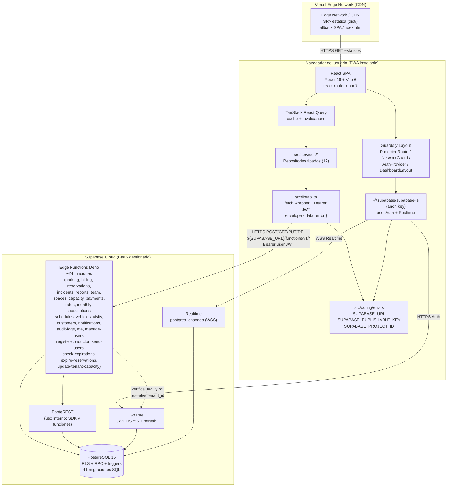
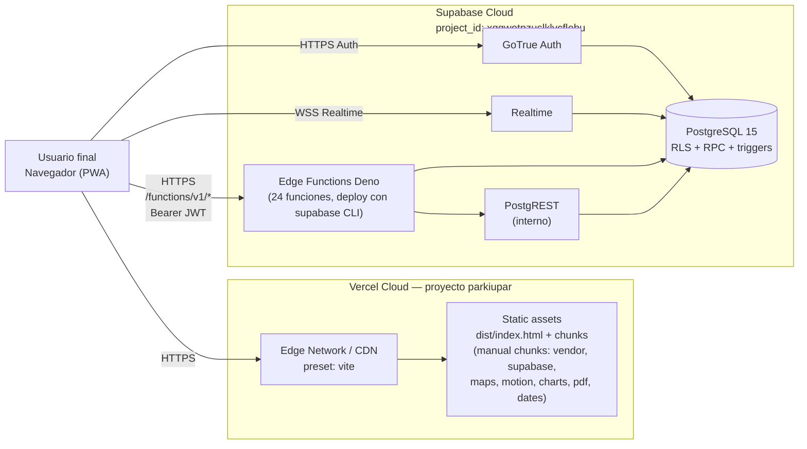
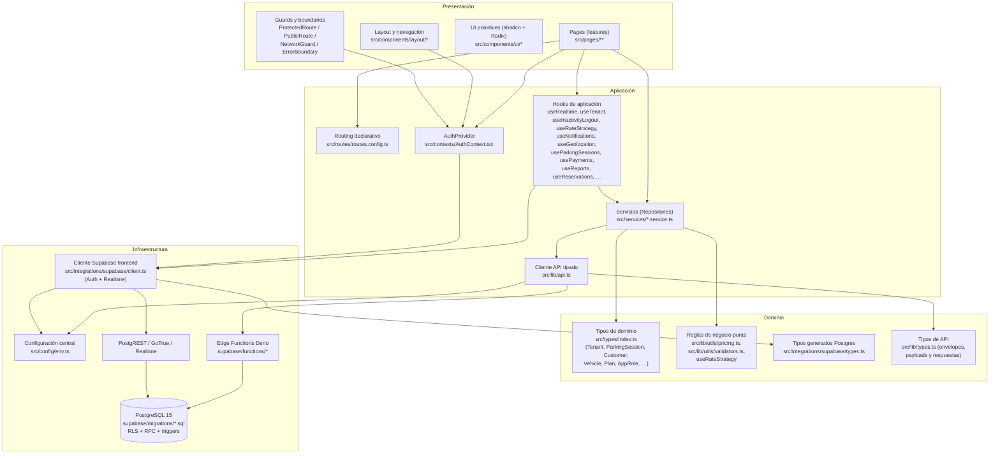

# Documentación Técnica de Arquitectura de Software
## ParkiUpar — Software SaaS de Gestión de Parqueaderos

> Documento elaborado a partir del análisis estático del repositorio `parkiupar-53cb532b` (rama `main`) en su estado actual, posterior a la consolidación de la capa de API en Edge Functions de Supabase. Todas las afirmaciones se sustentan en archivos, rutas y patrones efectivamente presentes en el código fuente. Las versiones de dependencias se toman literalmente de `package.json`.

---

## 1. ARQUITECTURA Y DISEÑO TÉCNICO

### 1.1 Tipo de Arquitectura

**Arquitectura seleccionada:** Arquitectura **cliente-servidor distribuida** del tipo **SPA (Single-Page Application) + BaaS (Backend-as-a-Service)** con una **capa centralizada de API en funciones serverless** (Edge Functions de Supabase, runtime Deno), bajo un **modelo de tenancy lógico multi-tenant** materializado por Row Level Security (RLS) en PostgreSQL. La topología corresponde al paradigma *Jamstack evolucionado* sin un BFF intermedio: el cliente consume directamente las funciones serverless de Supabase como API canónica.

**Justificación técnica:**

1. **No es monolítica.** Existen tres planos de ejecución independientes con ciclos de despliegue y procesos diferenciados:
   - SPA estática (`src/`, compilada a `dist/` por Vite 6 — `vite.config.ts:42-67`), servida por la CDN de Vercel.
   - Plataforma Supabase gestionada: PostgreSQL 15, PostgREST, GoTrue y Realtime (consumida en el cliente exclusivamente para autenticación y suscripciones en tiempo real, vía `@supabase/supabase-js ^2.98.0` en `src/integrations/supabase/client.ts:22`).
   - Edge Functions de Supabase (Deno) en `supabase/functions/*` — veinticuatro funciones serverless que constituyen la **única superficie de API de negocio** del sistema.

2. **No son microservicios canónicos.** Las funciones Edge comparten una misma base PostgreSQL (anti-patrón frente al modelo *database-per-service* de microservicios estrictos), no existe descubrimiento de servicios, ni broker de mensajes, ni propiedad de datos por servicio. Sin embargo, sí existen **límites funcionales claros por dominio** (parking, billing, reservations, incidents, reports, team, etc.), cada uno desplegado y versionado como una función independiente.

3. **No es un BFF (Backend-for-Frontend) en sentido estricto.** El proyecto **no opera un servidor intermedio propio** (no hay servidor Express, Hono, Fastify ni equivalente). El cliente HTTP del frontend (`src/lib/api.ts:79`) emite peticiones directamente contra `${VITE_SUPABASE_URL}/functions/v1/*`, sin reescrituras a un proceso Node controlado por el equipo. La autenticación se inyecta como `Authorization: Bearer <access_token>` (token de Supabase Auth) y las funciones Edge verifican el JWT en su cuerpo. El archivo `vercel.json` declara únicamente *fallback* de SPA hacia `/index.html`, no rutas `/api/*`.

4. **Posee elementos event-driven en su capa de propagación.** Supabase Realtime se consume vía WebSocket en el hook `src/hooks/useRealtime.ts:12-38`, que ante eventos `INSERT/UPDATE/DELETE` invalida las claves correspondientes en TanStack Query (`^5.90.21`), forzando refetch contra las Edge Functions. Esto inserta un canal asíncrono coexistente con el flujo request/response síncrono.

5. **Es multi-tenant con aislamiento lógico (no físico).** Todas las tablas relevantes incluyen `tenant_id` y las políticas RLS en PostgreSQL restringen el acceso por tenant a partir del JWT del usuario autenticado. Las funciones Edge complementan este aislamiento aplicando comprobaciones server-side y, cuando lo requieren, usando el cliente `service_role` para operaciones administrativas controladas.

**En síntesis:** la arquitectura responde a una topología **SPA + BaaS centralizada en Edge Functions Deno**, con autorización canónica vía RLS de PostgreSQL y autenticación basada en JWT de Supabase Auth. El modelo de tenancy es **multi-tenant lógico** sobre un esquema compartido.

---

### 1.2 Descripción de la Solución Arquitectónica

#### 1.2.1 Componentes Principales

| # | Componente | Responsabilidad | Tecnología | Ubicación |
|---|---|---|---|---|
| 1 | **SPA ParkiUpar** | Interfaz integral: routing, formularios, mapas, dashboard, reportes, PWA instalable. | React `^19.2.4`, React Router DOM `^7.13.1`, Vite `^6.4.1`, `@vitejs/plugin-react-swc ^3.11.0`, `vite-plugin-pwa ^1.2.0` | `src/main.tsx`, `src/App.tsx`, `src/AppContent.tsx` |
| 2 | **Router declarativo** | Tabla de rutas con `lazy()` por feature, agrupadas por `allowedRoles` (`'admin'`, `'conductor'`). | TypeScript | `src/routes/routes.config.ts` |
| 3 | **AuthProvider** | Hidratación de sesión Supabase, resolución de `role` y `tenant_id`, auto-logout por inactividad. | React Context, `@supabase/supabase-js` | `src/contexts/AuthContext.tsx` |
| 4 | **Capa de servicios (Repositories)** | Doce módulos por agregado de negocio, exportados desde un *barrel* que documenta explícitamente Dependency Inversion: *“Components depend on service abstractions, not Supabase directly.”* (`src/services/index.ts:1-4`). Todos los servicios delegan en `@/lib/api`. | TypeScript | `src/services/{parking,space,reservation,vehicle,customer,billing,incident,report,team,tenant,geolocation,visit}.service.ts` |
| 5 | **Cliente API centralizado** | Cliente HTTP tipado que apunta a `${SUPABASE_URL}/functions/v1` (importado desde `@/config/env`). Inyecta `Authorization: Bearer <access_token>`, normaliza el envelope `{ data, error }` en `ApiError`, ejerce `signOut` y redirección ante HTTP 401. | TypeScript, Fetch API | `src/lib/api.ts` |
| 6 | **Cliente Supabase frontend** | Cliente público con la `SUPABASE_PUBLISHABLE_KEY` (anon) importada desde `@/config/env`. **Uso restringido**: autenticación (sesión, refresh, signOut) y canales Realtime. No se usa para CRUD de negocio. | `@supabase/supabase-js ^2.98.0` | `src/integrations/supabase/client.ts` |
| 6b | **Configuración central** | Único punto de verdad de los parámetros de conexión a Supabase (`SUPABASE_PROJECT_ID`, `SUPABASE_URL`, `SUPABASE_PUBLISHABLE_KEY`), embebidos en el bundle al compilar. Sustituye al esquema de variables `import.meta.env.VITE_*` y elimina la dependencia de archivos `.env` en el repositorio. | TypeScript | `src/config/env.ts` |
| 7 | **Hooks de aplicación** | Cross-cutting reactivo: `useRealtime`, `useTenant`, `useInactivityLogout`, `useRateStrategy`, `useGeolocation`, `useNotifications`, `useCountdown`, `useParkingSessions`, `usePayments`, `useReports`, `useReservations`, `useSchedules`, `useTeam`, `useIncidents`, `useCustomers`, `useRates`, `useMonthlySubscriptions`, `useVehicleCategories`, `useCapacity`, `useThemeColor`. | React Hooks + TanStack Query | `src/hooks/*` |
| 8 | **Guards de navegación** | `ProtectedRoute`, `PublicRoute`, `NetworkGuard`, `ErrorBoundary`. | React | `src/components/{ProtectedRoute,PublicRoute,NetworkGuard,ErrorBoundary}.tsx` |
| 9 | **Layout autenticado** | Sidebar, layout dashboard, navegación móvil. | React + Radix Sidebar | `src/components/layout/{AppSidebar,DashboardLayout,MobileBottomNav}.tsx` |
| 10 | **Sistema de diseño** | Primitivas shadcn/ui apoyadas en Radix UI (≈ 27 paquetes `@radix-ui/react-*` declarados en `package.json`). | Radix UI, Tailwind CSS `^3.4.19`, `class-variance-authority`, `clsx`, `tailwind-merge` | `src/components/ui/*` |
| 11 | **Edge Functions de Supabase (Deno)** | Veinticuatro funciones serverless que conforman la API canónica del sistema, agrupadas por dominio: usuarios (`manage-users`, `register-conductor`, `seed-users`, `team`, `me`), operaciones (`parking`, `spaces`, `reservations`, `capacity`, `schedules`, `vehicles`), finanzas (`billing`, `payments`, `rates`, `monthly-subscriptions`), incidentes y reportes (`incidents`, `audit-logs`, `reports`, `notifications`), visitas (`visits`) y jobs (`expire-reservations`, `check-expirations`, `update-tenant-capacity`). | Deno, `@supabase/supabase-js` server-side | `supabase/functions/*/index.ts`, `supabase/functions/_shared/*` |
| 12 | **PostgreSQL 15 (Supabase)** | Esquema multi-tenant: `tenants`, `plans`, `user_profiles`, `customers`, `vehicles`, `vehicle_rates`, `parking_sessions`, `parking_spaces`, `payments`, `incidents`, `audit_logs`, `reservations`, `monthly_subscriptions`. Enums: `app_role` (colapsado a `superadmin`, `admin`, `conductor`), `vehicle_type`, `session_status`, `license_type`. RLS habilitada en todas las tablas tenant-scoped. Incluye RPCs (`reserve_parking`) y triggers. | PostgreSQL gestionado por Supabase | `supabase/migrations/*.sql` (41 migraciones; relevantes: `20260506120000_collapse_roles_to_three.sql`, `20260506130000_reserve_parking_rpc.sql`, `20260506140000_reservation_vehicle_type_and_admin_rpcs.sql`) |
| 13 | **PostgREST** | Exposición REST automática del esquema (usada internamente por el cliente Supabase JS y por las Edge Functions, no expuesta como API de negocio al SPA). | Servicio gestionado | (Supabase Cloud) |
| 14 | **GoTrue** | Autenticación, firma JWT HS256, refresh de tokens, reset/sign-up. | Servicio gestionado | (Supabase Cloud) |
| 15 | **Supabase Realtime** | Streaming de `postgres_changes` por WebSocket. | Servicio gestionado | Consumido vía `src/hooks/useRealtime.ts` |
| 16 | **Service Worker / PWA** | Cache offline del shell y assets, instalable. | `vite-plugin-pwa` (Workbox) | `vite.config.ts:14-37` |
| 17 | **CDN Vercel** | Hosting estático global del bundle SPA. *Fallback* SPA configurado en `vercel.json`. | Vercel Edge Network | `vercel.json` |

#### 1.2.2 Interacción entre Componentes

Los flujos canónicos del sistema son:

1. **Autenticación.** `src/main.tsx` monta `<App />` → `src/App.tsx:18-26` envuelve la app en `ErrorBoundary → QueryClientProvider → BrowserRouter` → `src/AppContent.tsx` monta `AuthProvider`, el cual invoca `supabase.auth.getSession()` y se suscribe a `onAuthStateChange`. Tras hidratar la sesión, lee el perfil del usuario (Edge Function `me`) para obtener `role` y `tenant_id`. `ProtectedRoute` bloquea el render hasta resolver el rol; ante tenant suspendido redirige a `/suspended`. `useInactivityLogout` cierra sesión automáticamente tras una ventana de inactividad.

2. **Operación de negocio (vía Edge Functions).** Los servicios `src/services/*.service.ts` invocan al objeto tipado `api.*` en `src/lib/api.ts`. El cliente HTTP construye la URL `${SUPABASE_URL}/functions/v1/<recurso>` (la constante `SUPABASE_URL` se importa desde `@/config/env`), añade el header `Authorization: Bearer <access_token>` (obtenido vía `supabase.auth.getSession()`) y emite la petición. La Edge Function verifica el JWT, resuelve el `tenant_id` desde `user_profiles` y ejecuta la operación contra PostgreSQL aplicando reglas de negocio y RLS. La respuesta sigue el contrato `{ data, error }`; el cliente desempaqueta y lanza `ApiError` con `status`, `code` y `message` si procede. Un HTTP 401 ejecuta `signOut` y redirige a `/login`.

3. **Tiempo real.** `useRealtime({ table, filter, queryKeys })` abre un canal `realtime-${table}-${filter}` contra Supabase Realtime (WSS) y, ante cualquier evento `INSERT/UPDATE/DELETE`, invalida las claves de React Query indicadas, forzando refetch contra la Edge Function correspondiente.

4. **Tareas administrativas y jobs.** Algunas funciones se configuran con `verify_jwt = false` (`supabase/config.toml:3-13`: `manage-users`, `seed-users`, `check-expirations`, `expire-reservations`) y validan el token y los roles manualmente dentro del handler, dado que su superficie incluye casos especiales (alta inicial, jobs programados, expiración no autenticada).

5. **Mapa público.** La ruta pública `/map-public` (`src/routes/routes.config.ts`) renderiza un componente Leaflet `^1.9.4` con coordenadas leídas del agregado `tenants`, vía la Edge Function `me/tenant` o un endpoint público equivalente.

6. **Modo offline.** `NetworkGuard` se suscribe a los eventos `online/offline` del navegador y al pub/sub propio `src/lib/networkStatus.ts`, redirigiendo a `/no-internet`. La PWA cachea el shell con Workbox y permite reanudar el flujo cuando la conexión retorna.

#### 1.2.3 Resolución de Requerimientos

**Funcionales identificados en el código:**

| Requerimiento funcional | Componentes que lo resuelven |
|---|---|
| Gestión de espacios y aforo en tiempo real | `src/pages/parking/*`, `SpaceService` (`src/services/space.service.ts`), `api.spaces` y `api.capacity` (`src/lib/api.ts:205-209,268-281`), hook `useRealtime`, Edge Functions `spaces`, `capacity` |
| Reservas con expiración automática | `src/pages/reservations/ReservationsTab.tsx`, `ReservationService`, RPC `reserve_parking` (`supabase/migrations/20260506130000_reserve_parking_rpc.sql`), Edge Functions `reservations`, `expire-reservations`, `check-expirations` |
| Facturación, tarifas, suscripciones | `src/pages/billing/{RatesTab,PaymentsTab,SubscriptionsTab}.tsx`, `BillingService`, hook `useRateStrategy`, tabla `vehicle_rates`, Edge Functions `billing`, `payments`, `rates`, `monthly-subscriptions` |
| Multi-tenancy con planes SaaS | `tenants`, `plans`, `user_profiles.tenant_id`, RLS server-side, hook `useTenant`, redirección a `/suspended` |
| Multi-rol jerárquico | Enum `app_role` colapsado a tres en `supabase/migrations/20260506120000_collapse_roles_to_three.sql` (`superadmin`, `admin`, `conductor`); `ProtectedRoute` agrupa rutas por `allowedRoles` |
| Reportes y auditoría | `src/pages/reports/{ReportsTab,AuditLogTab}.tsx`, `ReportService`, generación PDF con `jspdf ^4.2.0` + `jspdf-autotable ^5.0.7`, tabla `audit_logs`, Edge Functions `reports` y `audit-logs` |
| Onboarding de conductores | Edge Function `register-conductor` (alta de usuario y perfil con `verify_jwt = false` y validación manual) |
| Notificaciones | `NotificationBell.tsx`, hook `useNotifications`, Edge Function `notifications`, librería `sonner ^2.0.7` |
| Visualización cartográfica | Leaflet 1.9, `MapLocationPicker.tsx`, ruta pública `/map-public` |
| Instalación como PWA | `vite-plugin-pwa`, manifest y service worker en `vite.config.ts:14-37` |
| Resiliencia ante caída de red | `NetworkGuard`, `src/lib/networkStatus.ts`, ruta `/no-internet`, cache Workbox |

**Requerimientos no funcionales atendidos:**

- **Seguridad.** Aplicada en tres planos coherentes: (i) RLS en Postgres por `tenant_id` y `role` para toda tabla tenant-scoped; (ii) verificación de JWT en cada Edge Function (Supabase aplica `verify_jwt = true` por defecto en funciones no listadas en `supabase/config.toml`), con validación manual del rol dentro del handler cuando procede; (iii) ausencia de exposición del `service_role` al cliente (la *publishable/anon key* es la única que viaja al navegador y es segura por diseño bajo RLS).
- **Rendimiento.** Lazy-loading por ruta (`lazy()` en `routes.config.ts`), `manualChunks` defensivo en `vite.config.ts:48-63` que evita ciclos cross-chunk con Radix, cache PWA del shell, `staleTime: 30 000 ms` y `gcTime: 5 min` en React Query (`src/App.tsx:6-15`), ejecución serverless de baja latencia.
- **Disponibilidad / escalabilidad.** Despliegue serverless: SPA en la CDN multi-PoP de Vercel y funciones Edge gestionadas por Supabase (Deno Deploy). Sin estado en el servidor; horizontalidad implícita.
- **Mantenibilidad.** Capa de servicios con principio de Inversión de Dependencias declarado explícitamente (`src/services/index.ts:1-4`); agrupación por feature; tipado estricto en el frontend (`tsconfig.app.json`); una única superficie de API tipada (`api.*` en `src/lib/api.ts`) que centraliza contratos.
- **Compatibilidad y accesibilidad.** Primitivas Radix UI conformes a WAI-ARIA, soporte PWA, modo oscuro (`next-themes ^0.4.6`), navegación móvil dedicada (`MobileBottomNav`).

#### 1.2.4 Consideraciones de Calidad

- **Escalabilidad.** El núcleo (Vercel CDN + Supabase) escala horizontalmente sin intervención operativa. El cuello de botella probable es PostgreSQL, dado que las políticas RLS son evaluadas por fila en consultas amplias del rol `superadmin`. Se mitiga con paginación explícita en los handlers y con RPCs para operaciones complejas (p. ej. `reserve_parking`). La eliminación del BFF intermedio reduce la latencia agregada al recortar un salto de red.

- **Seguridad.** El stack es estructuralmente defendible: RLS multi-tenant + JWT por Edge Function + separación de llaves (`anon` en cliente, `service_role` solo dentro de las funciones Edge). Riesgos operativos identificables: (i) las Edge Functions `manage-users`, `seed-users`, `check-expirations` y `expire-reservations` declaran `verify_jwt = false` (`supabase/config.toml:3-13`), por lo que la validación queda delegada al cuerpo del handler — debe auditarse rigurosamente en cada una; (ii) tras la limpieza reciente, las variables de entorno reales viven en `.env.local` (ignorado por git) y `.env` contiene solo placeholders, lo que reduce la superficie de exposición de secretos a nivel de repositorio, pero el historial de git aún preserva valores previos y debe rotarse el `SUPABASE_SERVICE_ROLE_KEY` en el dashboard.

- **Mantenibilidad.** Se respeta una separación en cuatro capas (presentación, aplicación, dominio, infraestructura) con una única vía de acceso a datos (`api.*` → Edge Functions). Esta consolidación —ejecutada al retirar el BFF Hono y los gateways intermedios— elimina la doble superficie de validación que coexistía previamente. Persisten páginas monolíticas de gran tamaño (`SuperAdmin.tsx`, `MapTab.tsx`, `LandingPage.tsx`) que mezclan lógica de presentación y de aplicación. El proyecto declara `vitest ^4.0.18` como dependencia y posee `vitest.config.ts`, pero no expone un *script* `test` en `package.json`.

- **Extensibilidad.** El diseño modular por features (`src/pages/{billing,parking,reports,reservations,users,visits,admin,…}` y `supabase/functions/*`) facilita la adición de nuevos dominios. Añadir un endpoint requiere: (a) crear `supabase/functions/<nuevo>/index.ts`, (b) declarar la firma en `src/lib/api.ts`, (c) crear el servicio en `src/services/`, (d) consumirlo desde el hook o página. El esquema de migraciones SQL versionado en `supabase/migrations/` (41 archivos) provee un mecanismo evolutivo trazable, y la disponibilidad de RPCs Postgres (p. ej. `reserve_parking`) habilita la encapsulación de reglas críticas dentro del motor relacional.

---

## 2. DIAGRAMAS DE ARQUITECTURA

> Todos los diagramas siguientes están expresados en sintaxis **Mermaid** para su renderización directa en GitHub, GitLab o cualquier visor compatible.

---

### 2.1 Diagrama de Componentes y Conectores (C&C)

El siguiente diagrama representa los componentes en ejecución (procesos lógicos cooperantes) y los conectores que los integran. Refleja una **única vía de datos**: el SPA consume las Edge Functions de Supabase como API canónica.



**Descripción de componentes:**

| Componente | Tipo | Responsabilidad sintetizada |
|---|---|---|
| SPA ParkiUpar | Cliente web (proceso del navegador) | Render, formularios, estado UI, PWA |
| React Query | Cache cliente | Memoización de queries y mutaciones |
| Capa de servicios | Módulo de aplicación | Encapsula acceso a la API (Repository) |
| Cliente `api.*` | Cliente HTTP tipado | Único punto de acceso a las Edge Functions |
| Cliente Supabase | SDK | Auth (sesión, refresh) y Realtime (WSS) |
| Guards y Layout | Componentes de control | AuthN/AuthZ, conectividad, layout autenticado |
| CDN Vercel | Infraestructura de entrega | Distribución global de assets estáticos |
| Edge Functions Deno | FaaS | API canónica del sistema (~24 funciones) |
| PostgREST | Servicio gestionado | REST sobre Postgres (consumido server-side) |
| GoTrue | Servicio gestionado | Autenticación y emisión de JWT |
| Realtime | Servicio gestionado | Streaming de cambios |
| PostgreSQL 15 | Almacén persistente | Datos relacionales, RLS, RPCs, triggers |

**Descripción de conectores:**

| Origen | Destino | Protocolo | Dirección | Propósito |
|---|---|---|---|---|
| SPA → CDN | Vercel Edge Network | HTTPS | C → S | Entrega de assets estáticos y `index.html` |
| `api.*` → Edge Functions | Supabase | HTTPS + `Authorization: Bearer <user JWT>` | C → S | Toda operación CRUD y de negocio |
| Cliente Supabase JS → GoTrue | Supabase | HTTPS | C ↔ S | Sign-in, refresh, reset, signOut |
| Cliente Supabase JS → Realtime | Supabase | WSS | C ↔ S | Suscripción a `postgres_changes` |
| Edge Function Deno → Postgres | Supabase | Driver Supabase JS server-side | S → S | Lectura/escritura con `service_role` o token del usuario según función |
| Edge Function → GoTrue (lógico) | Supabase | Verificación local del JWT | S | AuthN sin round-trip externo |

---

### 2.2 Diagrama de Despliegue

El siguiente diagrama localiza los componentes lógicos sobre la infraestructura real: el proyecto Vercel (CDN para assets estáticos) y los servicios externos gestionados por Supabase. No existe Edge Function propia en Vercel: la única superficie de cómputo bajo demanda es la flota de Edge Functions de Supabase.



**Descripción de nodos:**

| Nodo | Runtime | Escalado | Notas operativas |
|---|---|---|---|
| Edge Network Vercel | Multi-PoP global, sin cold start perceptible | Automático | Sirve `dist/`; *fallback* SPA: `/(.*) → /index.html` (`vercel.json:5-7`) |
| SPA estática | Archivos estáticos | Cache CDN | Build con `vite build` → `dist/` |
| PostgreSQL 15 | Instancia gestionada por Supabase | Vertical según plan Supabase | RLS habilitada; 41 migraciones en `supabase/migrations/` |
| GoTrue / Realtime / PostgREST | Servicios gestionados | Gestionado | Realtime activado por tabla (no auditable desde el repo) |
| Edge Functions Deno (Supabase) | Deno Deploy (gestionado) | Por invocación | Configuración por función en `supabase/config.toml`; cuatro declaran `verify_jwt = false` |

**Configuración del frontend** (centralizada en código, sin archivos `.env`):

| Constante | Plano | Origen en el código |
|---|---|---|
| `SUPABASE_PROJECT_ID` | Frontend | `src/config/env.ts` |
| `SUPABASE_URL` | Frontend | `src/config/env.ts` |
| `SUPABASE_PUBLISHABLE_KEY` (anon) | Frontend | `src/config/env.ts` |

> **Nota operativa.** El proyecto no usa archivos `.env`: los tres parámetros de conexión a Supabase viven en `src/config/env.ts` y se embeben en el bundle al ejecutar `vite build`. La `PUBLISHABLE_KEY` (anon) está diseñada por Supabase para ser pública; la seguridad efectiva proviene de las políticas RLS de PostgreSQL. Las credenciales server-side (`SUPABASE_SERVICE_ROLE_KEY`) sólo existen dentro del entorno de las Edge Functions de Supabase y no son accesibles desde el navegador. Cambiar de proyecto o de entorno requiere editar `src/config/env.ts` y recompilar.

---

### 2.3 Diagrama de Capas

El sistema, considerado integralmente (cliente + funciones Edge + BaaS), se descompone en cuatro capas con dependencia descendente. La regla de dependencia (presentación → aplicación → dominio → infraestructura, sin saltos hacia arriba) se cumple de forma mayoritaria; las excepciones razonadas se documentan en la descripción.



**Descripción de capas:**

- **Presentación.** Responsable de la representación visual y captura de entrada. Incluye `src/pages/**` (rutas-feature: `parking`, `reservations`, `billing`, `customers`, `reports`, `incidents`, `users`, `visits`, `admin`, `auth`, `legal`, `content`), los componentes de layout (`DashboardLayout`, `AppSidebar`, `MobileBottomNav`), las primitivas `src/components/ui/*` (shadcn/ui sobre Radix), y los componentes-control (`ProtectedRoute`, `PublicRoute`, `NetworkGuard`, `ErrorBoundary`). Su única dependencia legítima son la capa de Aplicación y los tipos del Dominio.

- **Aplicación.** Orquesta los casos de uso. Comprende el `routes.config.ts`, el `AuthProvider`, los hooks (`src/hooks/*`), los servicios `src/services/*.service.ts` y el cliente API tipado `src/lib/api.ts`. La capa de servicios depende explícitamente de abstracciones (declaración en `src/services/index.ts:1-4`) y delega de forma uniforme en `api.*`, lo que elimina toda dependencia directa de los componentes con el SDK de Supabase para CRUD de negocio.

- **Dominio.** Comprende los tipos de dominio (`src/types/index.ts`: `Tenant`, `Plan`, `Customer`, `Vehicle`, `ParkingSession`, `Reservation`, `Payment`, enums `AppRole`, `VehicleType`, etc.), las reglas puras de tarifación y validación (`src/lib/utils/*`, `useRateStrategy`), los tipos generados desde el esquema Postgres (`src/integrations/supabase/types.ts`) y los contratos de la API tipada (`src/lib/types.ts`: envelopes, payloads, respuestas). El dominio es predominantemente *anémico*: la lógica de negocio crítica reside en servicios y en RPCs SQL (p. ej. `reserve_parking`).

- **Infraestructura.** Acceso a sistemas externos y configuración estática: cliente Supabase del frontend (Auth + Realtime), módulo de configuración central (`src/config/env.ts`) que provee `SUPABASE_URL` y `SUPABASE_PUBLISHABLE_KEY` al cliente y al `api.*`, Edge Functions Deno desplegadas en Supabase y PostgreSQL. No depende de capas superiores. Las migraciones SQL definen el esquema, las RPCs y las políticas RLS que constituyen el contrato de la infraestructura de datos.

**Observaciones sobre la regla de dependencia:**

- `AuthContext` importa `@supabase/supabase-js` directamente, lo cual es aceptable por tratarse del propio módulo de autenticación.
- `useRealtime` (capa Aplicación) importa el cliente Supabase porque la suscripción WSS es una primitiva del SDK que no se expone vía Edge Functions.
- El `service_role` jamás se materializa en el cliente: vive exclusivamente dentro del entorno de ejecución de las Edge Functions de Supabase.
- La validación de entrada se ejerce en dos planos: a nivel de formularios (`react-hook-form ^7.71.2` + `@hookform/resolvers ^5.2.2` + `zod ^4.3.6`) y dentro de cada Edge Function antes de tocar PostgreSQL.

---

### 2.4 Diagrama de Descomposición

El siguiente diagrama refleja la descomposición jerárquica del sistema desde la raíz hasta los módulos hoja relevantes. Sólo se incluyen elementos efectivamente presentes en el árbol del repositorio.

```mermaid
graph TD
  ROOT["ParkiUpar (repositorio)"]

  ROOT --> FRONT["Frontend SPA<br/>src/"]
  ROOT --> SUPA["Supabase Workspace<br/>supabase/"]
  ROOT --> INFRA["Configuración e Infra"]
  ROOT --> DOCS["Documentación<br/>docs/, README.md"]

  FRONT --> F_PAGES["pages/ (features)"]
  FRONT --> F_COMP["components/"]
  FRONT --> F_SVC["services/ (12 repositorios)"]
  FRONT --> F_CTX["contexts/AuthContext"]
  FRONT --> F_HOOKS["hooks/ (~22)"]
  FRONT --> F_INT["integrations/supabase<br/>(client + types)"]
  FRONT --> F_LIB["lib/<br/>api.ts, types.ts, utils/"]
  FRONT --> F_CFG["config/<br/>env.ts (constantes Supabase)"]
  FRONT --> F_TYPES["types/"]
  FRONT --> F_ROUTES["routes/routes.config"]

  F_PAGES --> FP_LAND["LandingPage"]
  F_PAGES --> FP_DASH["Dashboard"]
  F_PAGES --> FP_AUTH["auth/<br/>Login, Register, Reset,<br/>Forgot, AccessDenied,<br/>Suspended, NoInternet"]
  F_PAGES --> FP_PARK["parking/<br/>ParkingTab, CapacityTab,<br/>MapTab, SchedulesTab,<br/>TenantView"]
  F_PAGES --> FP_RES["reservations/ReservationsTab"]
  F_PAGES --> FP_CUST["customers/index"]
  F_PAGES --> FP_BILL["billing/<br/>RatesTab, PaymentsTab,<br/>SubscriptionsTab"]
  F_PAGES --> FP_USER["users/<br/>TeamTab, MyPlanTab,<br/>SettingsTab"]
  F_PAGES --> FP_REP["reports/<br/>ReportsTab, AuditLogTab"]
  F_PAGES --> FP_INC["incidents/index"]
  F_PAGES --> FP_VIS["visits/VisitsTab"]
  F_PAGES --> FP_ADMIN["admin/SuperAdmin"]
  F_PAGES --> FP_CONT["content/TestimonialsTab"]
  F_PAGES --> FP_LEG["legal/Terms, Privacy"]

  F_COMP --> FC_LAYOUT["layout/<br/>AppSidebar, DashboardLayout,<br/>MobileBottomNav"]
  F_COMP --> FC_UI["ui/<br/>shadcn/Radix primitives"]
  F_COMP --> FC_CAP["capacity/<br/>EntryDialog, ExitDialog,<br/>ReserveDialog, SpaceGrid,<br/>CapacitySummary"]
  F_COMP --> FC_OTHER["ConfirmDialog, ErrorBoundary,<br/>NetworkGuard, NotificationBell,<br/>ProfileSettings, ProtectedRoute,<br/>PublicRoute, PullToRefresh,<br/>RouteFallback, MapLocationPicker"]

  F_SVC --> FS_LIST["parking, space, reservation,<br/>vehicle, customer, billing,<br/>incident, report, team, tenant,<br/>geolocation, visit"]

  F_LIB --> FL_API["api.ts<br/>cliente HTTP tipado<br/>(parking, customers, rates,<br/>capacity, payments,<br/>monthlySubscriptions, schedules,<br/>team, reports, incidents,<br/>reservations, notifications,<br/>spaces, vehicles, visits,<br/>auditLogs, billing, me)"]
  F_LIB --> FL_TYPES["types.ts<br/>contratos de API (envelopes,<br/>payloads, respuestas)"]
  F_LIB --> FL_UTILS["utils/<br/>pricing, validators, …"]

  SUPA --> SP_MIG["migrations/ (41 SQL)"]
  SUPA --> SP_FN["functions/ (24 funciones)"]
  SUPA --> SP_CFG["config.toml"]
  SUPA --> SP_INIT["init/00-schema.sql"]
  SUPA --> SP_SHARED["functions/_shared<br/>(helpers comunes Deno)"]

  SP_FN --> SPFN_USERS["manage-users<br/>register-conductor<br/>seed-users<br/>team / me"]
  SP_FN --> SPFN_OPS["parking / spaces<br/>reservations / capacity<br/>schedules / vehicles<br/>customers"]
  SP_FN --> SPFN_FIN["billing / payments<br/>rates / monthly-subscriptions"]
  SP_FN --> SPFN_INC["incidents<br/>audit-logs<br/>reports / notifications<br/>visits"]
  SP_FN --> SPFN_JOBS["expire-reservations<br/>check-expirations<br/>update-tenant-capacity"]

  INFRA --> IN_VER["vercel.json<br/>(framework + SPA fallback)"]
  INFRA --> IN_VITE["vite.config.ts<br/>(+ PWA + manualChunks)"]
  INFRA --> IN_TS["tsconfig*.json<br/>(app, node)"]
  INFRA --> IN_TAIL["tailwind.config.ts<br/>postcss.config.js"]
  INFRA --> IN_VITEST["vitest.config.ts"]

  DOCS --> D_README["README.md"]
  DOCS --> D_ARQ["docs/ARQUITECTURA.md"]
```



**Descripción de la descomposición:**

- **Nivel 0 (sistema).** El repositorio ParkiUpar.
- **Nivel 1 (subsistemas).** Frontend SPA, Supabase Workspace (migraciones + Edge Functions + configuración), Configuración/Infra y Documentación.
- **Nivel 2 (módulos).** Dentro del frontend: `pages` (features), `components`, `services`, `contexts`, `hooks`, `integrations`, `lib` (con el cliente tipado `api.ts` como pieza central), `types` y `routes`. Dentro de Supabase: migraciones SQL, funciones Edge Deno (con helpers compartidos en `_shared/`), configuración y *seed* inicial.
- **Nivel 3 (submódulos y componentes hoja).** Cada *feature* del frontend agrupa páginas concretas (p. ej. `parking/` agrupa cinco vistas); cada Edge Function reside bajo `supabase/functions/<feature>/index.ts`. El diagrama agrupa las funciones por dominio funcional (usuarios y equipo, operaciones, finanzas, incidentes y reportes, jobs programados) para preservar legibilidad.
- **Observación sobre simplificaciones recientes.** El repositorio fue depurado de capas intermedias inactivas: se removieron `microservices/` (artefacto histórico sin código vivo), `api/` (entrada Edge de Vercel que enrutaba al BFF) y `server/` (aplicación Hono con middlewares de seguridad, validación Zod y cliente `service_role`). El `vercel.json` se redujo a la configuración mínima de framework Vite con *fallback* SPA. Las dependencias `hono`, `jose` y `@upstash/redis` fueron retiradas de `package.json`. Adicionalmente, **se eliminó el archivo `.env`** y la indirección por `import.meta.env.VITE_*`: las constantes de conexión a Supabase residen ahora en `src/config/env.ts`, embebidas en el bundle al compilar (`src/vite-env.d.ts` queda reducido a la referencia mínima de tipos de Vite). La consecuencia arquitectónica es **una única superficie de API** (las Edge Functions de Supabase) y un **único punto de verdad** para los parámetros de conexión del cliente.

---

## 3. SÍNTESIS ARQUITECTÓNICA

ParkiUpar materializa una arquitectura **cliente-servidor distribuida** que combina, con coherencia técnica, una **SPA cliente** (React 19 + Vite 6, distribuida como PWA por la red Edge de Vercel) con un **Backend-as-a-Service multi-tenant** (Supabase: PostgreSQL 15 con RLS, PostgREST, GoTrue y Realtime) cuya **superficie de API canónica son veinticuatro Edge Functions Deno** (`supabase/functions/*`). El cliente consume estas funciones mediante un cliente HTTP tipado y centralizado (`src/lib/api.ts`), eliminando toda dependencia directa del SDK de Supabase para operaciones de negocio (el SDK queda restringido a autenticación y suscripciones Realtime). El modelo de tenancy es **multi-tenant lógico** sobre un esquema compartido, con aislamiento por `tenant_id` aplicado en RLS y reforzado en cada handler.

Las decisiones arquitectónicas más relevantes son: (i) la consolidación de la capa de datos en un único cliente tipado que apunta a `${SUPABASE_URL}/functions/v1/*` (con `SUPABASE_URL` importada desde `@/config/env`), lo que materializa el principio de Inversión de Dependencias declarado en `src/services/index.ts:1-4`; (ii) la verificación del JWT delegada a la plataforma Supabase (`verify_jwt = true` por defecto) con cuatro funciones de excepción configuradas en `supabase/config.toml` que validan token y rol manualmente; (iii) la aplicación de RLS multi-tenant en PostgreSQL como mecanismo de autorización canónico; (iv) la separación estricta de credenciales (`anon`/publishable embebida en el bundle del cliente, `service_role` exclusiva del entorno de las Edge Functions); (v) la lazy-loading exhaustiva por ruta y un esquema de `manualChunks` defensivo (`vite.config.ts:48-63`) que evita ciclos cross-chunk con Radix; (vi) la eliminación del BFF intermedio en Vercel, reduciendo latencia y unificando la superficie de validación en las funciones Deno; y (vii) la centralización de los parámetros de conexión en `src/config/env.ts` como único punto de verdad, sustituyendo la indirección por archivos `.env` y variables `import.meta.env.VITE_*`.

Como recomendaciones técnicas de cierre, derivadas estrictamente del estado del código, se identifican: **(1)** auditar y, en su caso, endurecer las cuatro Edge Functions que declaran `verify_jwt = false` (`manage-users`, `seed-users`, `check-expirations`, `expire-reservations`) verificando manualmente el token y el rol en cada handler y registrando los accesos en `audit_logs`; **(2)** rotar el `SUPABASE_SERVICE_ROLE_KEY` desde el dashboard de Supabase, dado que dicha clave residió en `.env` versionado en commits previos; **(3)** estandarizar la migración de los hooks que aún acceden a `supabase.functions.invoke(...)` para que utilicen exclusivamente `api.*`, garantizando que toda la API expuesta al SPA pase por un solo punto tipado; **(4)** descomponer las páginas monolíticas (`SuperAdmin.tsx`, `MapTab.tsx`, `LandingPage.tsx`) mediante extracción de hooks de datos y subcomponentes por sección; **(5)** incorporar un *script* `test` en `package.json` que invoque Vitest, ya declarado como dependencia, y completar una suite mínima de pruebas de servicios y hooks; **(6)** documentar la matriz de endpoints expuesta por `src/lib/api.ts` y mantenerla sincronizada con `supabase/functions/ENDPOINTS.md`; y **(7)** consolidar el contrato de envelope `{ data, error }` y los códigos de error (`code`) emitidos por cada Edge Function en un catálogo único.

La síntesis general es la de un sistema arquitectónicamente **defendible y escalable** —apoyado en un stack serverless de bajo costo operativo, una superficie de API unificada y un perímetro de seguridad apoyado en RLS multi-tenant— cuya principal deuda no es estructural sino de consolidación: cerrar la auditoría de las funciones con `verify_jwt = false`, rotar las credenciales server-side y formalizar el catálogo de la API tipada. Resueltos esos puntos, la topología actual sostiene de forma natural la evolución del producto SaaS multi-tenant que el código modela.

---

## 4. PROMPTS PARA REGENERACIÓN DE DIAGRAMAS

Esta sección provee cuatro *prompts* autocontenidos, listos para ser entregados a un asistente generativo (ChatGPT, Claude, Gemini) o pegados directamente en el **Mermaid Live Editor** (<https://mermaid.live>). Cada *prompt* describe el alcance, el conjunto de nodos exigidos, las aristas y las restricciones de sintaxis Mermaid necesarias para reproducir el diagrama original sin ambigüedades. Los *prompts* asumen que el modelo dispone únicamente del texto del prompt y no del código del repositorio; por ese motivo, incluyen toda la información mínima necesaria.

### 4.1 Prompt para el Diagrama de Componentes y Conectores (C&C)

> **Rol:** Eres un arquitecto de software senior. **Tarea:** Genera un diagrama Mermaid `flowchart TD` que represente los **componentes en ejecución y los conectores** del sistema ParkiUpar.
>
> **Contexto del sistema:** SPA en React 19 + Vite 6 servida desde Vercel CDN. Toda la API de negocio se expone como **Edge Functions Deno en Supabase** (`${SUPABASE_URL}/functions/v1/*`). El cliente Supabase JS solo se usa para autenticación (GoTrue) y Realtime (WSS); no para CRUD. Multi-tenant lógico con RLS en PostgreSQL.
>
> **Subgrafos requeridos:**
> 1. `CLIENT` («Navegador del usuario (PWA instalable)») con los nodos: `SPA` (React 19 + Vite 6 + React Router 7), `RQ` (TanStack React Query), `SVC` (`src/services/*`, 12 repositorios), `APICLI` (`src/lib/api.ts`, fetch + Bearer JWT, envelope `{ data, error }`), `SUPACLI` (`@supabase/supabase-js`, uso: Auth + Realtime), `CFG` (`src/config/env.ts` con `SUPABASE_URL`, `SUPABASE_PUBLISHABLE_KEY`, `SUPABASE_PROJECT_ID`), `GUARDS` (ProtectedRoute, NetworkGuard, AuthProvider, DashboardLayout).
> 2. `VERCEL` («Vercel Edge Network (CDN)») con el nodo `CDN` (sirve la SPA estática y aplica fallback SPA a `/index.html`).
> 3. `SUPABASE` («Supabase Cloud (BaaS gestionado)») con los nodos: `GOTRUE` (JWT HS256), `REALTIME` (postgres_changes WSS), `EDGEFN` (≈24 funciones Deno: parking, billing, reservations, incidents, reports, team, spaces, capacity, payments, rates, monthly-subscriptions, schedules, vehicles, visits, customers, notifications, audit-logs, me, manage-users, register-conductor, seed-users, check-expirations, expire-reservations, update-tenant-capacity), `PGREST` (PostgREST, uso interno), `POSTGRES` (PostgreSQL 15, 41 migraciones, RLS + RPC + triggers; usa la sintaxis `POSTGRES[(...)]` para forma cilíndrica).
>
> **Aristas requeridas:**
> - Internas del cliente: `SPA --> GUARDS`, `SPA --> RQ`, `RQ --> SVC`, `SVC --> APICLI`, `APICLI --> CFG`, `SUPACLI --> CFG`, `GUARDS --> SUPACLI`.
> - Internas de Supabase: `EDGEFN --> POSTGRES`, `EDGEFN --> PGREST`, `PGREST --> POSTGRES`, `GOTRUE --> POSTGRES`, `REALTIME --> POSTGRES`.
> - Conectores entre subgrafos (etiquetar):
>   - `CDN -->|HTTPS GET estáticos| SPA`
>   - `SUPACLI -->|HTTPS Auth| GOTRUE`
>   - `SUPACLI -->|WSS Realtime| REALTIME`
>   - `APICLI -->|"HTTPS POST/GET/PUT/DEL ${SUPABASE_URL}/functions/v1/* Bearer user JWT"| EDGEFN`
>   - `EDGEFN -.->|verifica JWT y rol, resuelve tenant_id| GOTRUE` (línea discontinua)
>
> **Restricciones de sintaxis:** Usa Mermaid v10+, `flowchart TD`, subgrafos con la sintaxis `subgraph ID["Título"] ... end`, etiquetas multilínea con `<br/>`, no uses emojis ni HTML entities, no uses estilos `classDef`/`style` salvo si lo pide explícitamente el caso. Devuelve únicamente el bloque ```mermaid```.

### 4.2 Prompt para el Diagrama de Despliegue

> **Rol:** Eres un arquitecto de software senior. **Tarea:** Genera un diagrama Mermaid `flowchart LR` que localice los componentes de ParkiUpar sobre la infraestructura real.
>
> **Contexto:** El sistema se despliega en dos planos físicos: (a) Vercel Cloud (proyecto `parkiupar`) que sirve la SPA estática vía su Edge Network/CDN; (b) Supabase Cloud (`project_id: xqgwetpzuslklycflebu`) que aloja PostgreSQL 15, GoTrue, Realtime, PostgREST y la flota de 24 Edge Functions Deno desplegadas con `supabase` CLI. **No existe ninguna función serverless propia en Vercel**: la única superficie de cómputo bajo demanda son las Edge Functions de Supabase. El cliente lleva embebido en el bundle (`src/config/env.ts`) los parámetros `SUPABASE_URL` y `SUPABASE_PUBLISHABLE_KEY` (anon).
>
> **Nodos exigidos:**
> - `USER`: «Usuario final, Navegador (PWA)».
> - Subgrafo `VERCEL` («Vercel Cloud — proyecto parkiupar», `direction TB`): `CDN` (preset vite), `SPA_DIST` (assets estáticos `dist/index.html` + chunks `vendor, supabase, maps, motion, charts, pdf, dates`).
> - Subgrafo `SUPA` («Supabase Cloud, project_id: xqgwetpzuslklycflebu», `direction TB`): `AUTH` (GoTrue), `RT` (Realtime), `FN` («Edge Functions Deno, 24 funciones, deploy con supabase CLI»), `REST` (PostgREST interno), `PG` (PostgreSQL 15, RLS + RPC + triggers, forma cilíndrica `PG[(...)]`).
>
> **Aristas exigidas:**
> - Dentro de `VERCEL`: `CDN --> SPA_DIST`.
> - Dentro de `SUPA`: `AUTH --> PG`, `RT --> PG`, `FN --> REST`, `FN --> PG`, `REST --> PG`.
> - Entre el usuario y los planos:
>   - `USER -->|HTTPS| CDN`
>   - `USER -->|HTTPS Auth| AUTH`
>   - `USER -->|WSS Realtime| RT`
>   - `USER -->|"HTTPS /functions/v1/* Bearer JWT"| FN`
>
> **Restricciones:** `flowchart LR`, subgrafos con `direction TB`, sin estilos `classDef`. Devuelve únicamente el bloque ```mermaid```.

### 4.3 Prompt para el Diagrama de Capas

> **Rol:** Eres un arquitecto de software senior. **Tarea:** Genera un diagrama Mermaid `flowchart TD` que represente la **descomposición en cuatro capas** del sistema ParkiUpar (Presentación, Aplicación, Dominio, Infraestructura) con dependencia descendente estricta.
>
> **Nodos por capa:**
> - **L1 Presentación:** `P_PAGES` (Pages features `src/pages/**`), `P_LAYOUT` (`src/components/layout/*`), `P_UI` (shadcn + Radix, `src/components/ui/*`), `P_GUARDS` (`ProtectedRoute / PublicRoute / NetworkGuard / ErrorBoundary`).
> - **L2 Aplicación:** `A_ROUTES` (`src/routes/routes.config.ts`), `A_AUTH` (`src/contexts/AuthContext.tsx`), `A_HOOKS` (`src/hooks/*`: useRealtime, useTenant, useInactivityLogout, useRateStrategy, useNotifications, useGeolocation, useParkingSessions, usePayments, useReports, useReservations…), `A_SVC` (`src/services/*.service.ts`, 12 servicios), `A_CLI` (`src/lib/api.ts`, cliente API tipado).
> - **L3 Dominio:** `D_TYPES` (`src/types/index.ts`), `D_RULES` (`src/lib/utils/pricing.ts`, `validators.ts`, `useRateStrategy`), `D_PGTYPES` (`src/integrations/supabase/types.ts`), `D_APITYPES` (`src/lib/types.ts`, envelopes/payloads/respuestas).
> - **L4 Infraestructura:** `I_SUPACLI` (`src/integrations/supabase/client.ts`, uso: Auth + Realtime), `I_CFG` (`src/config/env.ts`), `I_FN` (`supabase/functions/*`, Edge Functions Deno), `I_PGREST` (PostgREST/GoTrue/Realtime), `I_PG` (PostgreSQL 15, `supabase/migrations/*.sql`, RLS + RPC + triggers; usar cilindro `I_PG[(...)]`).
>
> **Aristas exigidas (todas descendentes o intracapa, nunca ascendentes):**
> - `P_PAGES --> A_ROUTES`, `P_PAGES --> A_HOOKS`, `P_PAGES --> A_SVC`, `P_PAGES --> A_AUTH`
> - `P_LAYOUT --> A_AUTH`, `P_GUARDS --> A_AUTH`
> - `A_HOOKS --> A_SVC`, `A_HOOKS --> I_SUPACLI`
> - `A_SVC --> A_CLI`, `A_CLI --> I_FN`, `A_CLI --> I_CFG`, `A_AUTH --> I_SUPACLI`
> - `I_SUPACLI --> I_CFG`, `I_SUPACLI --> I_PGREST`, `I_FN --> I_PG`, `I_PGREST --> I_PG`
> - `A_SVC --> D_TYPES`, `A_CLI --> D_APITYPES`, `A_SVC --> D_RULES`, `I_SUPACLI --> D_PGTYPES`
>
> **Restricciones:** Usa `flowchart TD` y un subgrafo por capa (`L1 "Presentación"`, `L2 "Aplicación"`, `L3 "Dominio"`, `L4 "Infraestructura"`). No introduzcas aristas ascendentes (de L2 a L1, de L3 a L2, etc.). Devuelve únicamente el bloque ```mermaid```.

### 4.4 Prompt para el Diagrama de Descomposición

> **Rol:** Eres un arquitecto de software senior. **Tarea:** Genera un diagrama Mermaid `graph TD` que represente la **descomposición jerárquica** del repositorio ParkiUpar desde la raíz hasta los módulos hoja relevantes. Solo se incluyen elementos efectivamente presentes en el árbol del repositorio (no inventes archivos).
>
> **Estructura exigida (cuatro niveles):**
> - **Nivel 0 — Raíz:** `ROOT` («ParkiUpar (repositorio)»).
> - **Nivel 1 — Subsistemas:** `FRONT` («Frontend SPA, `src/`»), `SUPA` («Supabase Workspace, `supabase/`»), `INFRA` («Configuración e Infra»), `DOCS` («Documentación, `docs/, README.md`»).
> - **Nivel 2 — Módulos del frontend** (hijos de `FRONT`): `F_PAGES` (`pages/` features), `F_COMP` (`components/`), `F_SVC` (`services/` 12 repositorios), `F_CTX` (`contexts/AuthContext`), `F_HOOKS` (`hooks/` ~22), `F_INT` (`integrations/supabase` client + types), `F_LIB` (`lib/` api.ts, types.ts, utils/), `F_CFG` (`config/` env.ts con las constantes Supabase), `F_TYPES` (`types/`), `F_ROUTES` (`routes/routes.config`).
> - **Nivel 2 — Módulos de Supabase** (hijos de `SUPA`): `SP_MIG` (`migrations/` 41 SQL), `SP_FN` (`functions/` 24 funciones), `SP_CFG` (`config.toml`), `SP_INIT` (`init/00-schema.sql`), `SP_SHARED` (`functions/_shared` helpers comunes Deno).
> - **Nivel 2 — Infra** (hijos de `INFRA`): `IN_VER` (`vercel.json` framework + SPA fallback), `IN_VITE` (`vite.config.ts` + PWA + manualChunks), `IN_TS` (`tsconfig*.json` app y node), `IN_TAIL` (`tailwind.config.ts` y `postcss.config.js`), `IN_VITEST` (`vitest.config.ts`). **No incluyas archivos `.env*`**, han sido removidos del proyecto.
> - **Nivel 2 — Docs** (hijos de `DOCS`): `D_README` (`README.md`), `D_ARQ` (`docs/ARQUITECTURA.md`).
> - **Nivel 3 — Hojas del frontend** (hijos de `F_PAGES`): `FP_LAND` (LandingPage), `FP_DASH` (Dashboard), `FP_AUTH` (Login, Register, Reset, Forgot, AccessDenied, Suspended, NoInternet), `FP_PARK` (ParkingTab, CapacityTab, MapTab, SchedulesTab, TenantView), `FP_RES` (ReservationsTab), `FP_CUST` (customers/index), `FP_BILL` (RatesTab, PaymentsTab, SubscriptionsTab), `FP_USER` (TeamTab, MyPlanTab, SettingsTab), `FP_REP` (ReportsTab, AuditLogTab), `FP_INC` (incidents/index), `FP_VIS` (VisitsTab), `FP_ADMIN` (admin/SuperAdmin), `FP_CONT` (TestimonialsTab), `FP_LEG` (Terms, Privacy).
> - **Nivel 3 — Componentes** (hijos de `F_COMP`): `FC_LAYOUT` (AppSidebar, DashboardLayout, MobileBottomNav), `FC_UI` (shadcn/Radix primitives), `FC_CAP` (EntryDialog, ExitDialog, ReserveDialog, SpaceGrid, CapacitySummary), `FC_OTHER` (ConfirmDialog, ErrorBoundary, NetworkGuard, NotificationBell, ProfileSettings, ProtectedRoute, PublicRoute, PullToRefresh, RouteFallback, MapLocationPicker).
> - **Nivel 3 — Servicios** (hijo de `F_SVC`): `FS_LIST` («parking, space, reservation, vehicle, customer, billing, incident, report, team, tenant, geolocation, visit»).
> - **Nivel 3 — Lib** (hijos de `F_LIB`): `FL_API` (`api.ts` con bloques: parking, customers, rates, capacity, payments, monthlySubscriptions, schedules, team, reports, incidents, reservations, notifications, spaces, vehicles, visits, auditLogs, billing, me), `FL_TYPES` (`types.ts` contratos de API), `FL_UTILS` (`utils/` pricing, validators, …).
> - **Nivel 3 — Edge Functions agrupadas por dominio** (hijos de `SP_FN`): `SPFN_USERS` (manage-users, register-conductor, seed-users, team, me), `SPFN_OPS` (parking, spaces, reservations, capacity, schedules, vehicles, customers), `SPFN_FIN` (billing, payments, rates, monthly-subscriptions), `SPFN_INC` (incidents, audit-logs, reports, notifications, visits), `SPFN_JOBS` (expire-reservations, check-expirations, update-tenant-capacity).
>
> **Restricciones:** `graph TD`, etiquetas multilínea con `<br/>`. No incluyas elementos ya retirados del repositorio: BFF Hono (`server/`, `api/`), gateway legacy (`microservices/`), ni archivos `.env`/`.env.example`/`.env.local`. Devuelve únicamente el bloque ```mermaid```.

---

*Documento generado a partir del análisis estático del repositorio en su estado posterior a la consolidación en Edge Functions de Supabase y la centralización de los parámetros de conexión en `src/config/env.ts`. Cualquier sección puede revisarse a medida que evolucionen el catálogo de funciones y las políticas RLS del esquema.*
